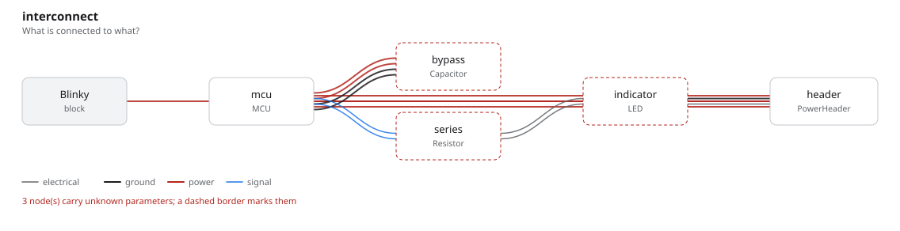
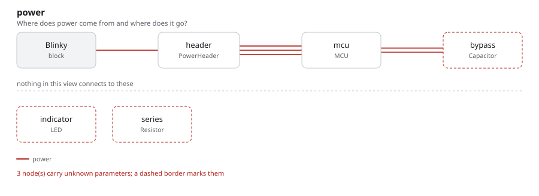

# blinky

An MCU pin, a series resistor, and an LED: the board everybody builds first.
Read it after [`divider/`](../divider/), because it is the first example where
the parts have *interfaces* rather than bare pads.

## The program

[`blinky.py`](blinky.py) declares its own parts. `MCU` is a `Part` with a
`PowerIn`, a `Signal`, three pins, and a `PinMap` joining the two:

```python
power = PowerIn(voltage=3.3 * V, current_demand=30 * mA)
blink = Signal()

pinmap = PinMap({"power.vcc": "VDD", "power.gnd": "VSS", "blink.line": "PA5"})
```

The pin map is what makes `self.header.dc >> self.mcu.power` mean something: one
connection between two typed surfaces lowers to the pads that carry it, and the
netlist below is that lowering, not a second description of it.

The constraint is the point of the example:

```python
require(self.series.resistance >= 150 * Ohm)
require(self.indicator.forward_current <= 20 * mA)
```

The 330 Ohm is not defended by the comment beside it. The bound it has to
satisfy is written down, so replacing the LED re-decides the question instead of
inheriting an old answer.

## What comes out

6 parts, 4 nets, 47 entities, 6 checks — none failed, one undecided.

That undecided one is worth reading in [`out/checks.txt`](out/checks.txt): the
board's `supply` surface has no `current_demand` on it, so "does the source
carry the load?" has no answer. The kernel says so rather than passing the check
on an assumed number.

- [`out/blinky.net`](out/blinky.net) — the KiCad netlist
- [`out/netlist.txt`](out/netlist.txt), [`out/graph.txt`](out/graph.txt)





## Running it

```bash
fang check   examples/blinky/blinky.py
fang netlist examples/blinky/blinky.py
fang view    examples/blinky/blinky.py power -o power.svg
```
