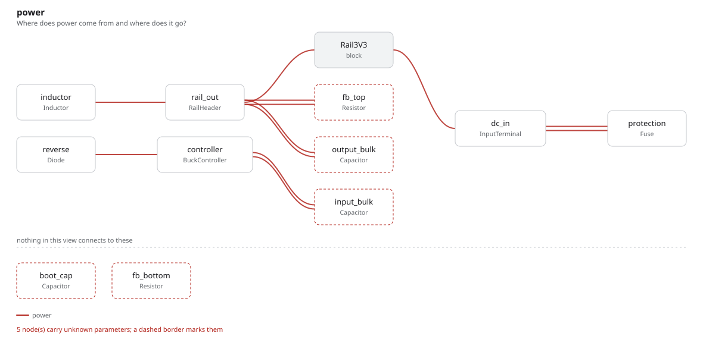
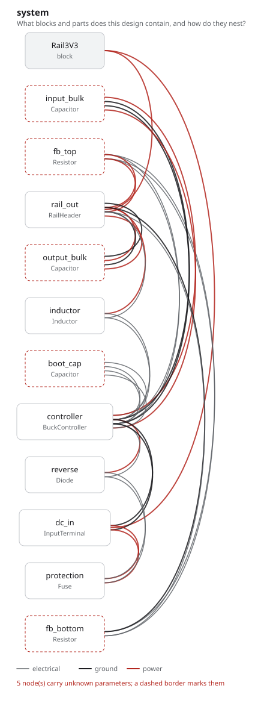

# buck_regulator

12 V to 3.3 V, with the reasoning kept beside the circuit. The converter itself
is ordinary; what is not ordinary is that the argument for it is in the same
graph as the inductor.

## The program

[`buck_regulator.py`](buck_regulator.py) records five kinds of reasoning as
entities, not comments:

```python
rail_tolerance = Requires("The 3V3 rail holds 3.3 V within 3% for 0 to 1.5 A over a 6 to 15 V input", ...)
part_choice    = Chooses("Which converter makes the 3V3 rail?", selected="TPS62130", ...)
ripple_current = Cites("Recommended inductor ripple is 20 to 40% of the maximum output current", ...)
inductor_value = Calculates("L = v_out * (1 - v_out / v_in) / (f_sw * ripple_current)", ...)
load_regulation = Verifies("rail_tolerance", ...)
```

So "why is this 4.7 µH?" has an answer the graph can give: a calculation, over a
datasheet claim, serving a requirement, which a verification closes. Nobody had
to write a design document, and nothing here can drift from the design, because
it *is* the design — change the evidence and the decision resting on it is
flagged.

The output voltage is deliberately not a parameter of the controller. It is set
by the feedback divider on the board, which is why the divider carries the
constraint that produces it.

## What comes out

12 parts, 9 nets, 118 entities, 15 checks — none failed, one undecided.

[`out/rationale.md`](out/rationale.md) is the file to read. It is the whole
argument, projected out of the graph in identifier order:

> ### system.inductor_value — `CALC-7d60a2e8f772`
>
> `L = v_out * (1 - v_out / v_in) / (f_sw * ripple_current)`
>
> Result: 4.7 uH at 1.25 MHz for 30% ripple at 1.5 A
>
> - Over `system.inductor` — Inductor (`CMP-64dfc4cd840c`)

- [`out/buck_regulator.net`](out/buck_regulator.net), [`out/netlist.txt`](out/netlist.txt)
- [`out/checks.txt`](out/checks.txt), [`out/graph.txt`](out/graph.txt)





## Running it

```bash
fang check   examples/buck_regulator/buck_regulator.py
fang view    examples/buck_regulator/buck_regulator.py power -o power.svg
```
