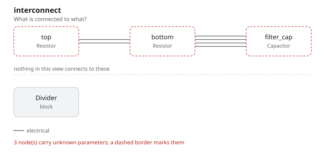

# divider

A voltage divider with a capacitor across its output: two resistors, one cap,
and nothing else. It is here to show the shape of a Fang program and no more
than that.

## The program

[`divider.py`](divider.py) declares three surfaces (`supply`, `output`,
`ground`), three parts, and joins them in `architecture`. The `>>` operator is
the only way parts get connected, and every connection is an entity in the graph
rather than a line in a file:

```python
top = Resistor(resistance=10 * kOhm, package="R_0603_1608Metric")

def architecture(self):
    self.top.p2 >> self.bottom.p1
```

The two constraints say what the divider is not allowed to be — a leg under
1 kOhm — rather than restating the values that were already written above them.
That is the distinction the whole language rests on: a value is a choice, a
constraint is the reason the choice is allowed.

## What comes out

4 parts, 2 nets, 28 entities, 2 checks, none failed and none undecided. This is
the only example with nothing undecided in it, because it is the only one with
no missing datasheet number anywhere.

- [`out/divider.net`](out/divider.net) — the KiCad netlist
- [`out/netlist.txt`](out/netlist.txt) — the same projection as text
- [`out/checks.txt`](out/checks.txt) — both checks, both decided
- [`out/graph.txt`](out/graph.txt) — 28 entities, by kind



The two resistors are drawn by the name they have in the program — `top` and
`bottom` — because `Resistor` twice would not tell you which one is which.

## Running it

```bash
fang check   examples/divider/divider.py
fang netlist examples/divider/divider.py
fang export  examples/divider/divider.py -o divider.net
fang view    examples/divider/divider.py interconnect -o interconnect.svg
```
