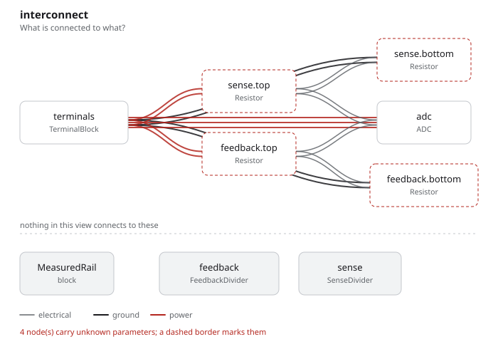

# equations

A divider written as the ratio it has to satisfy, rather than as two numbers
someone computed offstage — and then reused, by inheritance, at a different
ratio.

## The program

[`equations.py`](equations.py) puts Ohm's law in the graph:

```python
division = self.bottom.resistance / (self.top.resistance + self.bottom.resistance)
require(self.ratio_max >= division)
require(self.ratio_min <= division)
require(self.v_in <= self.i_bleed * (self.top.resistance + self.bottom.resistance))
```

`Arithmetic` checks dimensions when the expression is *constructed*, so a
dimensionally invalid equation cannot be stored, let alone evaluated. What
survives to check time is arithmetic that already type-checks.

`SenseDivider(FeedbackDivider)` is the reuse: it keeps every equation and
replaces the two resistors, so 24 V onto a 3.3 V ADC is the same design at an
eighth of the ratio. The board then instantiates both with different bounds:

```python
feedback = FeedbackDivider(v_in=12 * V, i_bleed=250 * uA, ratio_min=0.19 * ratio, ...)
sense    = SenseDivider(v_in=24 * V, i_bleed=200 * uA, ratio_min=0.09 * ratio, ...)
```

`ratio = UnitLiteral("1")` is how a project adds a unit — dimensionless, here —
without editing the language.

## What comes out

7 parts, 6 nets, 72 entities, 12 checks, none failed and none undecided. Twelve
decided checks over two dividers is the whole point: every bound in both blocks
has the numbers it needs to be answered.

- [`out/equations.net`](out/equations.net), [`out/netlist.txt`](out/netlist.txt)
- [`out/checks.txt`](out/checks.txt), [`out/graph.txt`](out/graph.txt)



## Running it

```bash
fang check   examples/equations/equations.py
fang graph   examples/equations/equations.py
```
