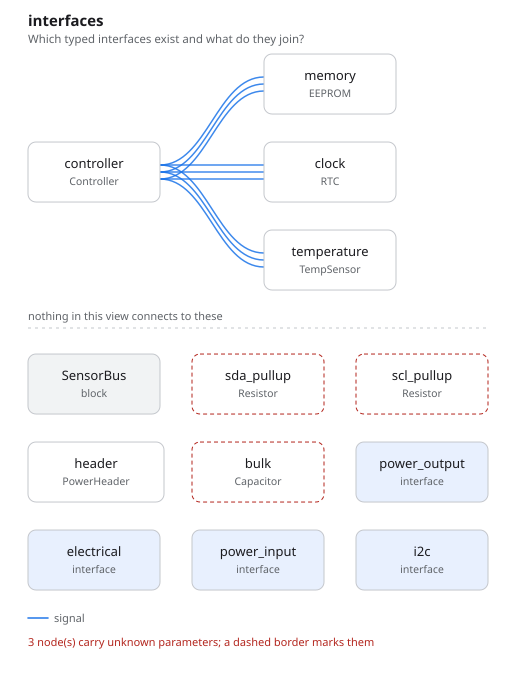
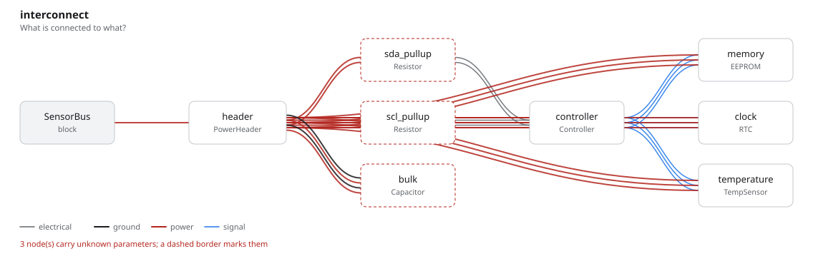

# i2c_bus

One controller and three targets on a shared I2C bus. A bus is multi-drop, so
the same port is connected three times and the lowering resolves it into one net
per signal — not three point-to-point links.

## The program

[`i2c_bus.py`](i2c_bus.py) keeps two things a netlist could not hold.

**The addresses are parameters**, so uniqueness is a constraint the kernel
decides, not a rule inside a linter:

```python
address = Parameter("", description="7-bit I2C address")
...
require(self.temperature.address != self.memory.address)
```

**The unread datasheet is recorded as unread.** `TempSensor` and `EEPROM` cite
their thresholds with `Cites(...)`; the `RTC` does not have them, and says so:

```python
thresholds = Assumes(
    "The RTC accepts 3.3 V CMOS levels",
    rationale="every part in this family does; not yet read off the datasheet",
)
```

An assumption is not a value. The compatibility check over the RTC's link stays
undecided, which is the state that gets someone to open the datasheet.

## What comes out

9 parts, 4 nets, 98 entities, 39 checks — none failed, **seven undecided**.

Six of those seven are one missing pair of numbers, `vih_min` and `voh_min` on
an I2C port — the RTC's, the only device on the bus whose datasheet nobody has
read. The seventh is the board's supply, which states no current demand. The
program predicted both, and the checks found them.

- [`out/i2c_bus.net`](out/i2c_bus.net), [`out/netlist.txt`](out/netlist.txt)
- [`out/checks.txt`](out/checks.txt) — 39 checks, seven of them undecided
- [`out/rationale.md`](out/rationale.md) — the address requirement, and the two
  datasheet claims that *are* cited



Four devices, one bus: the interfaces view draws each device's link to the
controller, and the parts that carry no interface — the pull-ups, the bulk cap —
below the rule, because in this view nothing connects to them.



## Running it

```bash
fang check   examples/i2c_bus/i2c_bus.py
fang view    examples/i2c_bus/i2c_bus.py interfaces -o interfaces.svg
```
