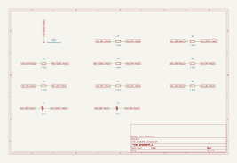
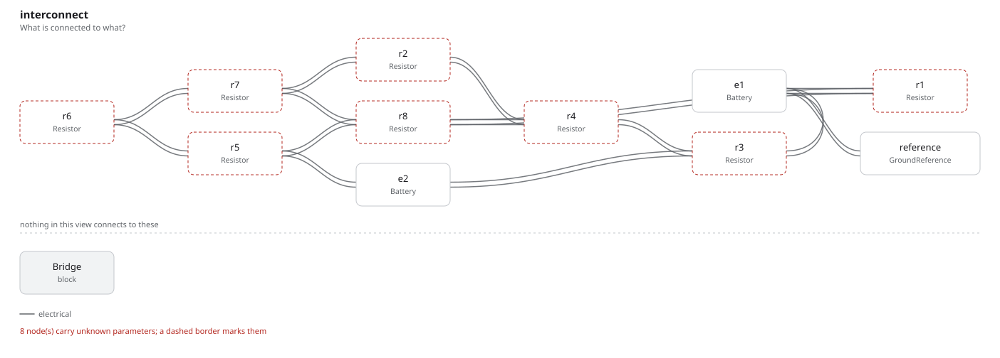

# problem_1 — JEE (Advanced) 2022

Eight 1 Ω resistors and two ideal batteries, ε₁ = 12 V and ε₂ = 6 V, arranged
as a diamond with a centre node. It is JEE (Advanced) 2022, Paper 1, question 1,
which asks which of four claimed currents are correct:

| | Claim |
| --- | --- |
| (A) | the current through R1 is 7.2 A |
| (B) | the current through R2 is 1.2 A |
| (C) | the current through R3 is 4.8 A |
| (D) | the current through R5 is 2.4 A |

This is the one example that is not a board, and it is here because the
question is the same one a board asks all day: *is this claim about my circuit
true?* The kernel answers it the way it answers any other — the potentials are
a value, Kirchhoff's current law is a constraint, and each of the four claims is
a constraint the checker decides. **All four hold.**

## The circuit

The four corners are left, top, right and bottom. R6 and R7 are the upper
sides, R5 and R8 the lower ones, and R2 and R4 run down the vertical axis into
the centre. The middle row runs

```
left corner -- ε₂ -- R3 -- centre -- ε₁ -- R1 -- right corner
```

with both batteries pointing the same way, so each lifts the node on its right.
`GND1` is the centre: a one-terminal part that marks the node the potentials
are measured against, and adds nothing to it.

## The program

[`problem_1.py`](problem_1.py) claims five numbers and nothing else:

```python
v_centre = Parameter("V", default=0 * V, description="the reference node")
v_left   = Parameter("V", default=-1.2 * V, description="the left corner")
v_top    = Parameter("V", default=1.2 * V, description="the top corner")
v_right  = Parameter("V", default=4.8 * V, description="the right corner")
v_bottom = Parameter("V", default=1.2 * V, description="the bottom corner")
```

Every current below is derived from those by Ohm's law, so there is one claim
to check and not thirteen. Kirchhoff's current law is then written once per
node, and the four statements the paper asks about are written beside them in
the same form — a constraint, not a comment:

```python
require(equals(total(into_centre, from_left_to_top, from_left_to_bottom), no_current))
...
require(equals(out_of_centre, 7.2 * A))       # (A) 7.2 A through R1
```

A parameter reference builds an expression node from one operator, and
Kirchhoff needs them nested, so the tree is written out with three small
helpers. That is not a workaround: every node checks its own dimensions as it
is constructed, so a term that divides a potential by the wrong parameter is
rejected where it is written rather than where it is evaluated.

Five node equations and four claims: nine constraints, and **the checker
decides all nine and fails none**. Move any potential and the node equations
fail first, which is what makes the four claims worth anything.

## Where the potentials came from

They were not solved in the program — the kernel checks claims, it does not
solve linear systems. [`solve.py`](solve.py) elaborates the same graph, has
`fang.simulation` compile a plan and lower it to SPICE, and runs ngspice on the
deck fang wrote:

```
R1 2 3 1          V1 2 0 12
R2 4 0 1          V2 5 7 6
...
```

`GND1` marks a node and is not a device, so it carries no simulation model, and
a plan that reaches a component with no model is rejected rather than run with
a stand-in. Naming it as abstracted is what lets the plan compile, and the plan
then says so in its own assumptions:

```
assumption: CMP-fe129c51b056 is abstracted: it contributes no device to the netlist
```

The operating point gives all eight branch currents — R1 7.2 A, R2 1.2 A,
R3 4.8 A, R4 1.2 A, R5 2.4 A, R6 2.4 A, R7 3.6 A, R8 3.6 A — and the five
potentials go into the program, where the constraints judge them. The two paths
are independent: ngspice solves, the kernel decides.

## The question and the answer are in the graph too

A netlist says what the circuit is. It does not say what was asked of it, or
what came back. Both are entities here — the question and its four options are
`Cites`, the answer is `Requires`, the numbers are `Calculates`, and a
`Verifies` closes the requirement — so [`out/rationale.md`](out/rationale.md)
carries them out of the program without anything being retyped:

> **system.answer** — All four options hold: (A), (B), (C) and (D)
> MUST, state KNOWN, validation by analysis.
> Verified by `system.answered`: **PASS** by analysis

with each option scored against the branch it names:

> (A) r1 7.2 A — correct; (B) r2 1.2 A — correct; (C) r3 4.8 A — correct;
> (D) r5 2.4 A — correct.

and every resistor with its value and its current beside it:

> every resistor is 1 Ω: r1 7.2 A, r2 1.2 A, r3 4.8 A, r4 1.2 A, r5 2.4 A,
> r6 2.4 A, r7 3.6 A, r8 3.6 A

## What comes out

11 parts, 7 nets, 99 entities, 9 checks, none failed and none undecided.

- [`out/problem_1.net`](out/problem_1.net): the KiCad netlist
- [`out/problem_1.kicad_sch`](out/problem_1.kicad_sch): the KiCad
  schematic, and [`out/schematic.svg`](out/schematic.svg) is KiCad's own render
  of it
- [`out/netlist.txt`](out/netlist.txt): the same projection as text, with the
  two batteries carrying 12 V and 6 V as their values
- [`out/checks.txt`](out/checks.txt): nine checks, all decided
- [`out/graph.txt`](out/graph.txt): 99 entities, by kind
- [`out/rationale.md`](out/rationale.md): the question, its four options,
  every resistor's value and current, and the answer — each one an entity,
  not prose



That is KiCad drawing a file `fang schematic` wrote, not a picture of a
circuit: open [`out/problem_1.kicad_sch`](out/problem_1.kicad_sch) in
Eeschema and it is a schematic like any other. Every terminal carries a global
label naming the net it is on, because a net is a fact in the graph and a wire
path is not — fang places parts and names nets, and does not route.

Read it as the netlist reads: `R1` sits between `Net-(R1-Pad1)`, which is the
junction inside the middle row, and `Net-(R1-Pad2)`, the right corner. Four net
names are the four corners and `Net-(GND1-Pad1)` is the centre.



The interconnect view is the other picture, and it answers a different
question: it is fang's own projection, drawn by `fang view`, and it names the
parts the way the program does. `r1` through `r8` are the resistors the paper
labels R₁ through R₈, and the two junctions inside the middle row — between
each battery and the resistor in series with it — are the two nets with only
two pads on them.

## Running it

```bash
fang check     examples/jee_advanced/problem_1/problem_1.py
fang netlist   examples/jee_advanced/problem_1/problem_1.py
fang view      examples/jee_advanced/problem_1/problem_1.py interconnect -o interconnect.svg
fang schematic examples/jee_advanced/problem_1/problem_1.py -o board.kicad_sch --svg board.svg

python examples/jee_advanced/problem_1/solve.py     # needs ngspice on PATH
```
