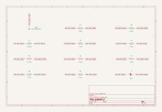
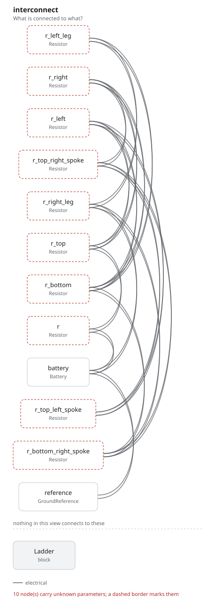

# problem_2 — JEE (Advanced) 2015

Ten resistors, one 6.5 V battery, and a single number. It is JEE (Advanced)
2015, question 13: *"In the following circuit, the current through the resistor
R (= 2 Ω) is I Amperes. The value of I is"*. **I = 1 A.**

The second of the two circuit-analysis examples, and it is here for the thing
[`problem_1/`](../problem_1/) does not show: a claim worth checking that
the paper never asks for. Two of the ten resistors carry nothing at all, and
that is the whole trick of the question — so the program claims that too, and
the checker decides it beside the answer.

## The circuit

A square with a resistor on each side, three spokes into a centre node, two
legs down to the bottom rail, and R in series with the battery feeding it:

| | | |
| --- | --- | --- |
| R | 2 Ω | in series with the battery; the one the question is about |
| top, left, right, bottom | 1 Ω, 6 Ω, 2 Ω, 10 Ω | the four sides of the square |
| top-left, top-right, bottom-right spokes | 2 Ω, 8 Ω, 4 Ω | into the centre |
| left leg, right leg | 12 Ω, 4 Ω | the lower corners down to the rail |

`GND1` is the bottom rail: a one-terminal part that marks the node the
potentials are measured against, and adds nothing to it.

## The program

[`problem_2.py`](problem_2.py) claims six numbers and nothing else:

```python
v_ground       = Parameter("V", default=0 * V,   description="the bottom rail")
v_top_left     = Parameter("V", default=4.5 * V, description="R's far end")
v_top_right    = Parameter("V", default=4 * V,   description="the top right corner")
v_centre       = Parameter("V", default=4 * V,   description="where the spokes meet")
v_bottom_left  = Parameter("V", default=3 * V,   description="the bottom left corner")
v_bottom_right = Parameter("V", default=3 * V,   description="the bottom right corner")
```

Every current is derived from those by Ohm's law, so there is one claim to
check and not ten. Kirchhoff's current law is written once per node, and then
the answer — and the two facts that explain it:

```python
require(equals(into_top_left, 1 * A))                     # I = 1 A through R

require(equals(bottom_left_to_bottom_right, no_current))  # the 10 ohm
require(equals(top_right_to_centre, no_current))          # the 8 ohm
```

Read the two potentials beside each of them and the trick is in the open:
`v_bottom_left` and `v_bottom_right` are both 3 V, and `v_top_right` and
`v_centre` are both 4 V. A resistor bridging equal potentials carries nothing,
which takes the 10 Ω and the 8 Ω out of the circuit entirely and leaves the
answer a round number.

Six node equations and three claims: nine constraints, and **the checker
decides all nine and fails none**. Move any potential and the node equations
fail first, which is what makes the three claims worth anything.

## Where the potentials came from

They were not solved in the program — the kernel checks claims, it does not
solve linear systems. [`solve.py`](solve.py) elaborates the same graph, has
`fang.simulation` compile a plan and lower it to SPICE, and runs ngspice on the
deck fang wrote. `GND1` carries no simulation model, so it is named as
abstracted, which is what lets the plan compile and what puts the abstraction
in the plan's own assumptions.

The operating point gives every branch: **R1 1 A** — that is I — with R2 and
R10, the 10 Ω and the 8 Ω, at exactly 0, and the rest 0.25 A to 0.75 A. The
potentials go into the program, where the constraints judge them. The two paths
are independent: ngspice solves, the kernel decides.

## The question and the answer are in the graph too

A netlist says what the circuit is. It does not say what was asked of it, or
what came back. Both are entities here — the question is `Cites`, the answer is
`Requires`, the numbers are `Calculates`, and a `Verifies` closes the
requirement — so [`out/rationale.md`](out/rationale.md) carries them out of the
program with nothing retyped:

> **system.answer** — The current I through R (= 2 Ω) is 1 A
> MUST, state KNOWN, validation by analysis.
> Verified by `system.answered`: **PASS** by analysis

and every resistor with its value and its current beside it:

> r (2 Ω) 1 A, r_top (1 Ω) 0.5 A, r_left (6 Ω) 0.25 A, r_right (2 Ω) 0.5 A,
> r_bottom (10 Ω) 0 A, r_top_left_spoke (2 Ω) 0.25 A,
> r_top_right_spoke (8 Ω) 0 A, r_bottom_right_spoke (4 Ω) 0.25 A,
> r_left_leg (12 Ω) 0.25 A, r_right_leg (4 Ω) 0.75 A

This paper's question is the integer-answer kind and offers nothing to choose
between, which is why the requirement states a number rather than a set of
letters. `problem_1` beside it does offer four options, and states them.

## What comes out

12 parts, 7 nets, 108 entities, 9 checks, none failed and none undecided.

- [`out/problem_2.net`](out/problem_2.net): the KiCad netlist
- [`out/problem_2.kicad_sch`](out/problem_2.kicad_sch): the KiCad
  schematic, and [`out/schematic.svg`](out/schematic.svg) is KiCad's own render
- [`out/netlist.txt`](out/netlist.txt): the same projection as text
- [`out/checks.txt`](out/checks.txt): nine checks, all decided
- [`out/graph.txt`](out/graph.txt): 108 entities, by kind
- [`out/rationale.md`](out/rationale.md): the question, every resistor's
  value and current, and the answer — each one an entity, not prose



Designators are assigned in the order the program names its parts, so `R1` is
`r`, the 2 Ω resistor the question asks about, and the rest run `R2` to `R10`
alphabetically by the name they have in the program. Every terminal carries a
global label naming the net it is on, because a net is a fact in the graph and
a wire path is not — fang places parts and names nets, and does not route.



The interconnect view answers the other question: it is fang's own projection,
drawn by `fang view`, and it names the parts the way the program does, so
`r_top_right_spoke` is the 8 Ω that turns out to carry nothing.

## Running it

```bash
fang check     examples/jee_advanced/problem_2/problem_2.py
fang netlist   examples/jee_advanced/problem_2/problem_2.py
fang view      examples/jee_advanced/problem_2/problem_2.py interconnect -o interconnect.svg
fang schematic examples/jee_advanced/problem_2/problem_2.py -o board.kicad_sch --svg board.svg

python examples/jee_advanced/problem_2/solve.py     # needs ngspice on PATH
```
