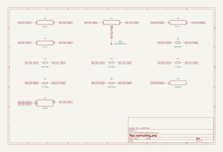
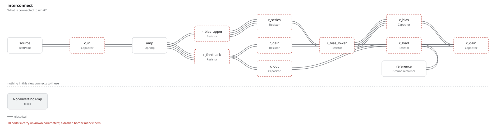

# noninverting_amp

An a.c.-coupled non-inverting amplifier, and the two numbers a textbook asks
of it: *"What is the input impedance in Figure 4.44? What is Av?"*
**Zin = 68.75 kΩ, Av = 16** — non-inverting, or +24 dB, over the midband.

The third example that is not a board. The two under
[`jee_advanced/`](../jee_advanced/) are exam questions with one right answer;
this one is here for what they do not show, which is that the answer depends
on a **reading of the schematic** before it depends on any arithmetic. The
reading is a decision, so it is an entity in the graph rather than a sentence
in a comment, and `out/rationale.md` carries it out with what it rejected.

## The circuit

| | | |
| --- | --- | --- |
| `c_in` | .1 µF | the source onto the + input |
| `r_bias_upper`, `r_series` | 220 kΩ, 100 kΩ | + input → bias node, side by side |
| `r_bias_lower`, `c_bias` | 220 kΩ, .5 µF | the bias node to ground, bypassed |
| `r_feedback`, `r_gain`, `c_gain` | 30 kΩ, 2 kΩ, 1 µF | output → − input → ground |
| `c_out`, `r_load` | .2 µF, 12 kΩ | the output into its load |

`U1` is an ideal op amp: two analog inputs, one analog output, and no rails,
because the figure draws none. `GND1` is a one-terminal part that marks the
node every claim is measured against.

## Neither answer is a property of the resistors

Both are midband answers, and which nodes are a.c. grounds is what decides
them:

- **The .5 µF** holds the bias node at a.c. ground, so the 220 kΩ and the
  100 kΩ both run from the input node to ground — in parallel, 68.75 kΩ. The
  *lower* 220 kΩ never appears in the answer: the .5 µF is across it. The op
  amp's own + input draws nothing worth subtracting.
- **The 1 µF** puts the bottom of the 2 kΩ at a.c. ground, which is what makes
  the gain `1 + 30k/2k` rather than 1. At d.c. that capacitor is an open and
  the stage falls to unity gain, which is what keeps the output offset small.
  The 12 kΩ load does not enter it: the op amp's output impedance is 0.

## The reading

The upper 220 kΩ is drawn over the top of the figure, and where its far end
lands is the whole question. `reading` records the one taken and both it
turned down:

```python
reading = Chooses(
    "Where does the upper 220 k return to?",
    selected="to the bias node, beside the 100 k, ...",
    alternatives=[
        {"reading": "to the op amp output, as a bootstrap", "reason": ...},
        {"reading": "to a supply rail, making the two 220 k a divider", "reason": ...},
    ],
)
```

Under the bootstrap reading the input impedance would be far higher than
68.75 kΩ, and under the divider reading the 100 kΩ would be the whole of it.
Same drawing, three different answers — so the reading is recorded rather than
assumed.

## The program

[`noninverting_amp.py`](noninverting_amp.py) claims three numbers:

```python
z_in    = Parameter("Ohm", default=68.75 * kOhm, description="what the source sees ...")
a_v     = Parameter("1",   default=16 * ratio,   description="the midband voltage gain ...")
midband = Parameter("Hz",  default=1 * kHz,      description="the bottom of the band ...")
```

Two constraints check the answers against the parts:

```python
require(equals(self.z_in, parallel(self.r_bias_upper.resistance, self.r_series.resistance)))
require(equals(self.a_v, total(1 * ratio, over(self.r_feedback.resistance, self.r_gain.resistance))))
```

and four more check what earns them — each capacitor's reactance at the bottom
of the claimed band, against the resistance it sits beside:

```python
require(at_most(reactance(self.c_in.capacitance, self.midband), a_tenth_of(self.z_in)))
```

`reactance` is `1 / (2πfC)`, written out as an expression tree. The reciprocal
of a frequency times a capacitance is an ohm, and `Arithmetic` checks that
where the expression is *constructed* — so a term with the wrong parameter in
it is rejected at the line that wrote it, not at the line that evaluated it.

At 1 kHz the four come out 1592 Ω against 6875, 318 Ω against 22 k, 159 Ω
against 200, and 796 Ω against 1200. **Six checks, none failed and none
undecided.** The gain leg is the tightest of the four, and that is not an
accident: its corner is 79.6 Hz, the highest of

| | R | C | corner |
| --- | ---: | ---: | ---: |
| input | 68.75 kΩ | .1 µF | 23.1 Hz |
| bias node | 220 kΩ | .5 µF | 1.4 Hz |
| gain leg | 2 kΩ | 1 µF | 79.6 Hz |
| output | 12 kΩ | .2 µF | 66.3 Hz |

so `midband` is a decade above it. Move any capacitor down a decade and the
two answers do not quietly stay true — a check fails and names which one.

## Where the numbers came from

Neither claim was solved in the program — the kernel decides claims, it does
not solve circuits — and a claim about a *band* asks for a sweep rather than an
operating point. [`solve.py`](solve.py) elaborates the same graph, has
`fang.simulation` compile an a.c. plan and lower it to SPICE, and runs ngspice
over 10 Hz to 1 MHz:

```
--- solved by ngspice-45.2, exit status 0 ---
  Av at 1 kHz                 15.94   16 claimed
  Av at 10 kHz                16.00
  Zin at 1 kHz           68,777 Ohm   68750 claimed
  Zin at 100 kHz         68,750 Ohm
```

Both claimed numbers are limits: 68,750 Ω and 16 are what the circuit
approaches once every capacitor is out of the way. At 1 kHz — the bottom edge
the program claims — the gain is 0.4% short of 16 and the impedance 0.04% over
68.75 kΩ, both from the reactance still left in the network. A decade higher
they are the claimed numbers.

Three parts carry no simulation model and are named as abstracted, which is
what lets the plan compile and what puts each one in the plan's assumptions:
`GND1` marks a node, `TP1` marks a terminal, and `U1` is an ideal op amp nobody
wrote a model for. Two cards are the script's own and it says so — `V1`, the
source the figure implies and never draws, and `E1`, a controlled source with a
gain of a million standing in for the abstracted op amp. The analysis is still
the plan's: the control block runs the `.ac` line `lower_to_spice` wrote rather
than asking for a second one.

## What comes out

13 parts, 8 nets, 114 entities, 6 checks, none failed and none undecided.

- [`out/noninverting_amp.net`](out/noninverting_amp.net): the KiCad netlist
- [`out/noninverting_amp.kicad_sch`](out/noninverting_amp.kicad_sch): the KiCad
  schematic, and [`out/schematic.svg`](out/schematic.svg) is KiCad's own render
- [`out/netlist.txt`](out/netlist.txt): the same projection as text
- [`out/checks.txt`](out/checks.txt): six checks, all decided
- [`out/graph.txt`](out/graph.txt): 114 entities, by kind
- [`out/rationale.md`](out/rationale.md): the question, the reading, the three
  calculations and the verification



The resistors and the ground marker have drawn symbols; the op amp and the
four capacitors are boxes with their own pins on them, which is what the
schematic compiler does for a part nobody has a symbol for. `U1`'s pins come
out where an engineer expects them — `IN-` and `IN+` on the left, `OUT` on the
right — because they are numbered 2, 3 and 6, the single-op-amp pinout, and
the box takes the pins in the order the graph gives them.



The interconnect view is fang's own projection, and it names the parts the way
the program does, so `r_bias_upper` and `r_series` are visibly the two that
meet at the + input and leave together.

## Running it

```bash
fang check     examples/noninverting_amp/noninverting_amp.py
fang netlist   examples/noninverting_amp/noninverting_amp.py
fang view      examples/noninverting_amp/noninverting_amp.py interconnect -o interconnect.svg
fang schematic examples/noninverting_amp/noninverting_amp.py -o board.kicad_sch --svg board.svg

python examples/noninverting_amp/solve.py     # needs ngspice on PATH
```
