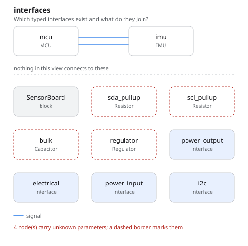
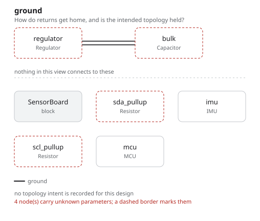

# sensor_board

A regulated board with an MCU and an I2C sensor on it. This is the example to
read to understand **lowering**: what happens between a typed interface and the
pads it lands on.

## The program

[`sensor_board.py`](sensor_board.py) gives the MCU two candidate pin pairs for
its I2C peripheral:

```python
pinmap = PinMap({
    "power.vcc": "VDD", "power.gnd": "VSS",
    "i2c.scl": ["PB8", "PB6"],
    "i2c.sda": ["PB9", "PB7"],
})
```

`self.mcu.i2c >> self.imu.i2c` is one line, and it has a choice inside it. The
lowering resolves that choice, and records a `Decision` entity naming what it
picked and what it passed over — [`out/rationale.md`](out/rationale.md) is those
decisions, resolved back to the names in the program:

> **Which pin of `system.mcu` carries i2c.scl?** → `system.mcu.PB8`

The pull-ups are on the board rather than in the parts, because on an open-drain
bus they belong to the net, and the regulator constraint states the intent
(`output_current_max >= 100 * mA`) instead of asserting an answer.

## What comes out

7 parts, 4 nets, 71 entities, 11 checks — none failed, **four undecided**.

The undecided ones are the reason this example exists.
[`out/checks.txt`](out/checks.txt) says why each is undecided, naming the value
that is missing rather than the check that is failing:

```
UNDECIDED interface_compatibility: voltage domain is undecided on power_input: voltage unknown; on PORT-b2153fd0d1b8
```

Nothing here assumed 3.3 V and moved on. Undecided is a third truth value, and
it is the honest one until someone supplies the number.

- [`out/sensor_board.net`](out/sensor_board.net), [`out/netlist.txt`](out/netlist.txt)
- [`out/rationale.md`](out/rationale.md) — the four lowering decisions
- [`out/graph.txt`](out/graph.txt) — 71 entities, 19 of them pins





## Running it

```bash
fang check   examples/sensor_board/sensor_board.py
fang view    examples/sensor_board/sensor_board.py interfaces -o interfaces.svg
fang build   examples/sensor_board/sensor_board.py
```
