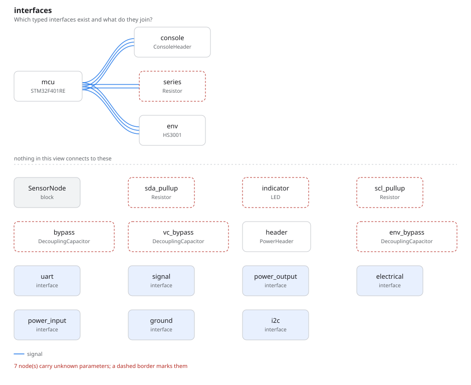

# sensor_node

An STM32F401RE reading an HS3001 humidity sensor over I2C1, with a serial
console on USART2 and a status LED on PA5. Read it after
[`sensor_board/`](../sensor_board/) and [`i2c_bus/`](../i2c_bus/): it adds the
two facts those boards leave to the firmware, **which controller a port is**
and **the address a device answers on**.

## The program

[`sensor_node.py`](sensor_node.py) declares both vendor parts itself. The MCU's
ports each name the peripheral instance they are, and each candidate pin
carries the alternate function that routes the signal to it:

```python
i2c1 = I2CPort(peripheral="I2C1", ...)
usart2 = UARTPort(peripheral="USART2", ...)

peripherals = PinMap(
    {
        "i2c1.scl": {"PB8": AF(4), "PB6": AF(4)},
        "i2c1.sda": {"PB9": AF(4), "PB7": AF(4)},
        "usart2.tx": {"PA2": AF(7)},
        "usart2.rx": {"PA3": AF(7)},
    },
    evidence="af_table",
)
```

`evidence="af_table"` names a `Cites` on the same part: ST's DS10086 Rev 5,
table 9, the alternate function mapping. A pin map with selectors and no
citation is refused at elaboration. Because `i2c1` is one controller, the
connection `self.mcu.i2c1 >> self.env.i2c` can only lower onto I2C1's pins;
SCL cannot land on I2C1 and SDA on I2C2. Each pin connection the lowering makes
records the selector of the pin it chose and the evidence for it:

```json
"selectors": {"PIN-6093c2974cd4": {"evidence": "EVD-355c4bf2d94a", "selector": "AF4"}}
```

That is PB8, the preferred SCL candidate, at AF4. The choice of PB8/PB9 over
PB6/PB7 is a decision entity, as on `sensor_board`.

The sensor's port carries its address:

```python
i2c = I2CPort(address=0x44 * addr, ...)   # addr = UnitLiteral("1")
```

An address is a dimensionless quantity, so `address=0x44` is refused with
`UNIT-0001` naming the parameter. The HS3001 has no strap pin; Renesas gives
0x44 as the only address it answers on. The compatibility check reads it, and
the addressing rule is decided: it passes, with the message
`addresses on i2c are distinct: 0x44 (PORT-b794dc65bafa)`. The MCU's port
declares no address. It is the controller, so it is not addressed and the rule
says nothing about it.

## What the datasheets say, and what they do not

Every pad number, selector, address and level in the program is cited by table
and page from ST's DS10086 Rev 5 and Renesas's R36DS0045EU0101 Rev 1.01.
[`out/rationale.md`](out/rationale.md) lists the ten citations.

The HS3001 datasheet states no input or output logic levels for SCL and SDA, so
the program states none. The logic-level check over I2C1 is undecided, naming
the sensor's `voh_min`, rather than passed on a number nobody read.

The MCU is reduced to the pins this board uses: one of its four VDD/VSS pairs,
the two I2C1 pin pairs, PA2, PA3 and PA5. The other supply pairs and their
capacitors, the 4.7 uF bulk capacitor, VCAP_1, VDDA, VBAT, NRST and BOOT0 are
not modelled. This is a board for the checks and for running firmware against,
not one to send to fabrication. The HS3001 is modelled whole, including its VC
capacitor and the pull-ups its application circuit requires.

## What comes out

11 parts, 9 nets, 132 entities, 11 checks. None failed, **three undecided**.

One is the sensor's logic levels, above. The other two are the console. The
header passes USART2 through to a serial adapter, and the `vih_min` and
`voh_min` on the far side of it are the adapter's. The header is this board's;
the adapter is not, and its levels are not known.

- [`out/sensor_node.net`](out/sensor_node.net), [`out/netlist.txt`](out/netlist.txt)
- [`out/checks.txt`](out/checks.txt): 11 checks, three of them undecided
- [`out/rationale.md`](out/rationale.md): the four lowering decisions and the
  ten datasheet citations
- [`out/graph.txt`](out/graph.txt): 132 entities, 34 of them pins



The MCU's three links: I2C1 to the sensor, USART2 to the console header, and
the status signal to the LED's series resistor.


The rail from the header to both parts and the pull-ups, with each part's
decoupling hung off its own supply pins. The VC capacitor joins the sensor's VC
pin to ground and touches no supply pin, so this view leaves it below the rule.

## Running it

```bash
fang check   examples/sensor_node/sensor_node.py
fang netlist examples/sensor_node/sensor_node.py
fang view    examples/sensor_node/sensor_node.py interfaces -o interfaces.svg
```
