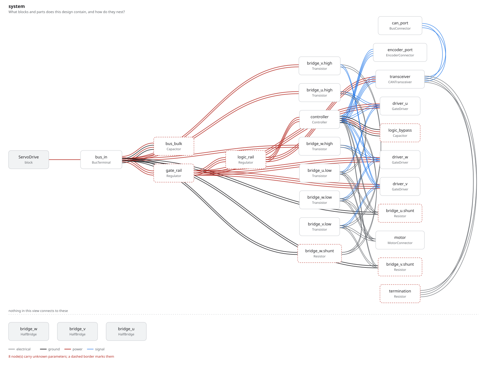
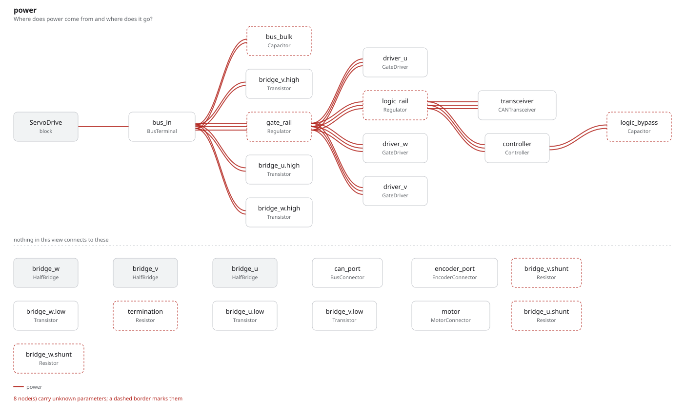
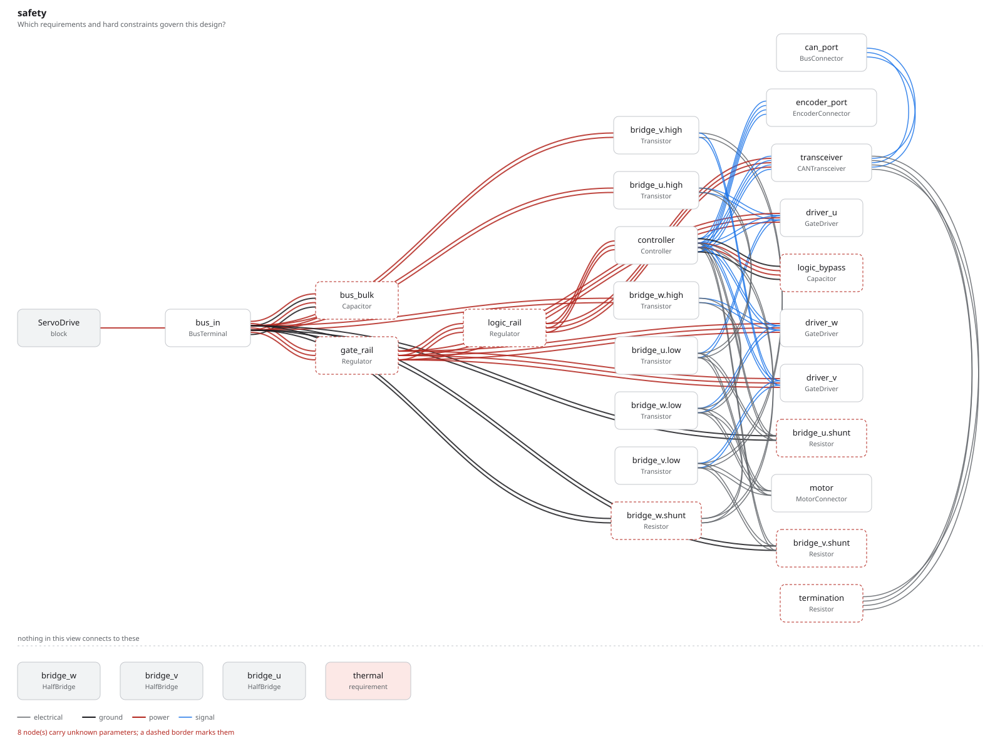

# servo_drive

Three half-bridges, CAN, an encoder and a shunt per phase: the board this
toolchain was written for. It is the composition example — the largest program
here, from the smallest amount of repetition.

## The program

[`servo_drive.py`](servo_drive.py) declares the bridge once:

```python
class HalfBridge(Module):
    high = Transistor(vds_max=100 * V, ..., package="PowerPAK-SO8")
    low = Transistor(vds_max=100 * V, ..., package="PowerPAK-SO8")
    shunt = Resistor(resistance=2 * mOhm, power_rating=2 * W, package="R_2512")

    def architecture(self):
        self.high.source >> self.low.drain
        self.low.source >> self.shunt.p1

    def constraints(self):
        require(self.high.vds_max >= 60 * V)
        require(self.shunt.power_rating >= 1 * W)
```

and instantiates it three times. A block owns its interior — its parts, its
connections, and its constraints — so the drive connects to the bridge's edge
and never reaches inside it. The three constraint sets are three separate
constraints in the graph, decided separately: a change to one phase does not
quietly pass because the other two are fine.

The phase, the encoder and the CAN bus are typed ports, so a connection says
what it carries rather than which pad it happens to land on.

## What comes out

24 parts, 26 nets, 310 entities, 46 checks — none failed, seven undecided. It is
the biggest graph in the examples by a factor of two.

- [`out/servo_drive.net`](out/servo_drive.net) — 24 components and 26 nets
- [`out/rationale.md`](out/rationale.md) — the requirements the drive states,
  and the assumption it is honest about
- [`out/checks.txt`](out/checks.txt) — 46 checks over 21 constraints —
  six of them from each bridge, three from the drive itself
- [`out/graph.txt`](out/graph.txt)



The three `bridge_*` blocks sit under the rule at the bottom: the system view
draws electrical connection, and a block connects through the parts inside it.
Their transistors are labelled `bridge_u.high`, `bridge_v.high` and so on — the
path is what distinguishes three instances of one declaration.





## Running it

```bash
fang check   examples/servo_drive/servo_drive.py
fang graph   examples/servo_drive/servo_drive.py
fang view    examples/servo_drive/servo_drive.py safety -o safety.svg
```
