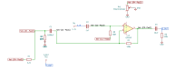

# ac_preamplifier

SBOA092B page 78, *AC Preamplifier*: the double-rolloff stage built for high
gain. E_I through C_2 1 µF onto the + input; R_2 100 kΩ from there to the
junction at the foot of C_1 1000 µF, which runs up to the - input; R_1 200 Ω
from the junction to ground, and beside it R_3 2.2 kΩ in series with R_4, a
10 kΩ rheostat; R_0 100 kΩ feedback; C_3 10 µF output coupling.

```
E_O / E_I = (R_0 + R_1) / R_1 = 500      R4 - Fine gain adjust
f_-3dB = 1 / (2 pi R_1 C_1) = 1.6 Hz      R_1 C_1 = R_2 C_2
```

## The circuit



The schematic is drawn by [copperhead](https://github.com/copperheadhq/copperhead)'s
drafting engine from this circuit's netlist, with KiCad's own library symbols,
and it opens in KiCad as [`figure/ac_preamplifier.kicad_sch`](figure/ac_preamplifier.kicad_sch).
The op amp is KiCad's generic one, since the handbook's are ideal, and each
terminal is a test point named as the program names it. KiCad reads back from
the sheet exactly the connections the circuit has; `draw.py` refuses to write
one that does not.


The interconnect view is fang's own projection. It names the parts as the
program does, so it reads against the code below.

## What the program says

In the midband the - input sees R_1 in parallel with R_3 + R_4, so the gain
is 1 + R_0 / (R_1 || (R_3 + R_4)). `trim` sets R_4 to full travel, 509, the
nearest the trim comes to 500 (`a_v`); `a_v_max` is the other end, 546.
`load` gives C_3 a 100 kΩ load, since the figure draws none. `f_low` holds
the computed 1/(2 pi R_1 C_1) = 0.80 Hz, and `t_1` and `t_2` hold
R_1 C_1 = 0.2 s and R_2 C_2 = 0.1 s.

## What the simulation found

[`out/simulation.txt`](out/simulation.txt):

| Run | Measured | Claimed |
| --- | ---: | ---: |
| `response`, gain at 100 Hz, R_4 = 10 kΩ | 509 | 509.2 (`a_v`), holds |
| `response`, -3 dB point at E_O | 0.81 Hz | 0.80 Hz (`f_low`) ±2%, holds |
| `response`, peak gain | 756.9 (+3.4 dB) | 757.7, holds |
| `response`, slope 0.1 to 0.3 Hz at the op amp | 40.9 dB/decade | 40 ±1.5, holds |
| `response`, input impedance at 100 Hz | 32.9 MΩ | not a claim |
| `response`, upper -3 dB point | 19.7 kHz | not a claim |
| `trim_at_zero`, gain at 100 Hz, R_4 = 0 | 546.2 | 546.5 (`a_v_max`), holds |
| `dc`, op amp output with E_I = 1 V d.c. | 0 V | 0 V, holds |

The bootstrap works: R_2 carries so little signal that E_I sees 33 MΩ, the
"high Z_in". The upper corner is the op amp's 10 MHz over a noise gain of
509.

## Where the handbook is off

- The gain: (R_0 + R_1) / R_1 is 501, and the printed 500 leaves out R_3 and
  R_4. With them beside R_1 the gain runs from 509 to 546 and never reaches
  500; to trim to 500, R_1 would have to be larger than 200 Ω.
- The corner: 1/(2 pi 200 Ω 1000 µF) is 0.80 Hz, not 1.6 Hz. 1.6 Hz is
  1/(2 pi R_2 C_2). The measured -3 dB point is 0.81 Hz.
- The rule R_1 C_1 = R_2 C_2 is not met: 0.2 s against 0.1 s. The response
  peaks 3.4 dB above the midband near 1.3 Hz, where the rule would give
  about 1.2 dB.

## Running it

```bash
fang check examples/ti_opamp_handbook/ac_amplifiers/ac_preamplifier/ac_preamplifier.py
python examples/regenerate.py ti_opamp_handbook/ac_amplifiers/ac_preamplifier   # needs ngspice
```
