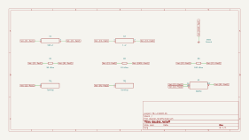
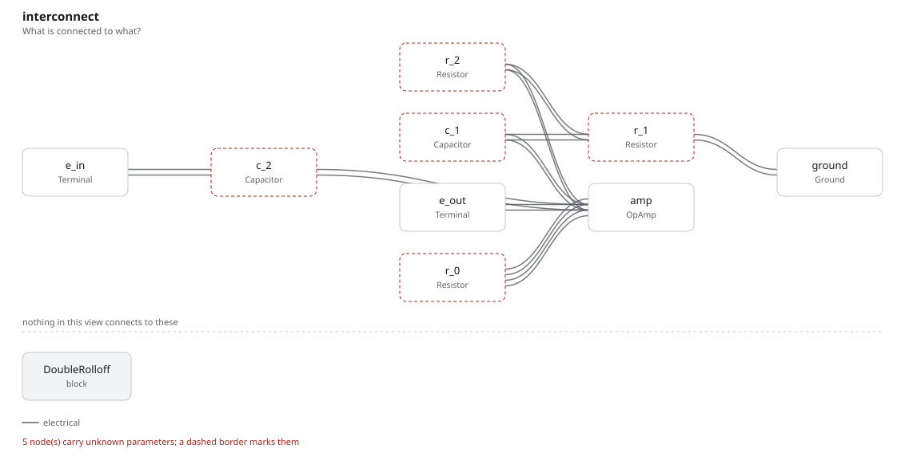

# double_rolloff

SBOA092B page 77, *Double Rolloff*: E_I through C_2 1 µF onto the + input;
R_0 90 kΩ from the output to the - input; C_1 100 µF from the - input down to
a junction, R_1 10 kΩ from the junction to ground, and R_2 100 kΩ from the +
input to the same junction, so that R_2 is bootstrapped.

```
"Similar to above."   C_1 R_1 = C_2 R_2
```

## The circuit



The schematic is compiled from the program and drawn by KiCad, and it opens in
KiCad as [`out/double_rolloff.kicad_sch`](out/double_rolloff.kicad_sch). A part with a symbol
of its own is drawn with it; the op amp and the handbook's other parts are
boxes carrying their own pins, and each net is a label rather than a wire.



The interconnect view is fang's own projection. It names the parts as the
program does, so it reads against the code below.

## What the program says

`topology` records the reading of the wiring: R_2 returns to the C_1 R_1
junction, not to ground. Solving the three nodes (`response`) gives

```
E_O / E_I = s T_2 (1 + R_1/R_2 + s (R_0 + R_1) C_1) / (s^2 T_1 T_2 + s T_2 (1 + R_1/R_2) + 1)
```

with T_1 = R_1 C_1 and T_2 = R_2 C_2: 10 in the midband, 40 dB per decade
below the poles, back to 20 dB per decade below a zero at 17.5 mHz. The drawn
values give T_1 = 1 s and T_2 = 0.1 s, so the page's rule does not hold.
`reading` keeps the drawn values, and the parameters `t_1` and `t_2` say
what they are, with a constraint that T_1 is ten times T_2.

## What the simulation found

[`out/simulation.txt`](out/simulation.txt):

| Run | Measured | Claimed |
| --- | ---: | ---: |
| `response`, gain at 1 kHz | 10 | 10 (`a_v`), holds |
| `response`, peak gain | 29.21 (+9.3 dB) | 29.21, holds |
| `response`, slope 0.05 to 0.15 Hz | 40.5 dB/decade | 40 ±1, holds |
| `response`, slope 1 to 10 mHz | 21.2 dB/decade | 20 ±1.5, holds |
| `response`, -3 dB point | 0.331 Hz | not a claim |
| `dc`, E_O with E_I = 1 V d.c. | 0 V | 0 V, holds |

The rolloff is double, as the title says, but with T_1 ten times T_2 the
poles have a Q of 2.9 and the response peaks 9.3 dB above the midband near
0.52 Hz.

## Where the handbook is off

The rule C_1 R_1 = C_2 R_2 is printed beside values that break it: 100 µF x
10 kΩ is 1 s, 1 µF x 100 kΩ is 0.1 s. With the rule met (C_2 = 10 µF, say)
the Q falls to 0.91 and the peak to 0.8 dB.

## Running it

```bash
fang check examples/ti_opamp_handbook/ac_amplifiers/double_rolloff/double_rolloff.py
python examples/regenerate.py ti_opamp_handbook/ac_amplifiers/double_rolloff   # needs ngspice and kicad-cli
```
