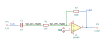
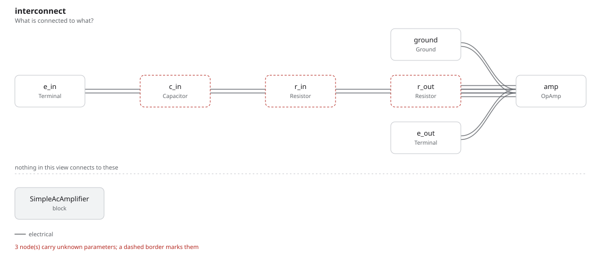

# simple_ac_amplifier

SBOA092B page 76, *Simple Amplifier*: E_I through C_I 1 µF and R_I 10 kΩ into
the summing point, R_O 100 kΩ from the output back to it, and the + input on
ground.

```
E_O = -R_O / R_I x E_I = -10 E_I
Z_in = 10 kΩ
f_-3dB = 1 / (2 pi R_I C_I) = 16 Hz
```

## The circuit



The schematic is drawn by [copperhead](https://github.com/copperheadhq/copperhead)'s
drafting engine from this circuit's netlist, with KiCad's own library symbols,
and it opens in KiCad as [`figure/simple_ac_amplifier.kicad_sch`](figure/simple_ac_amplifier.kicad_sch).
The op amp is KiCad's generic one, since the handbook's are ideal, and each
terminal is a test point named as the program names it. KiCad reads back from
the sheet exactly the connections the circuit has; `draw_figures.py` refuses to write
one that does not.



The interconnect view is fang's own projection. It names the parts as the
program does, so it reads against the code below.

## What the program says

Every value is drawn, so nothing is chosen. Three parameters hold the claims,
`a_v = -10`, `z_in = 10 kΩ` and `f_low = 16 Hz`; the last is held within 1%
of `corner(R_I, C_I)`, 15.92 Hz, because the page rounds it.

## What the simulation found

[`out/simulation.txt`](out/simulation.txt):

| Run | Measured | Claimed |
| --- | ---: | ---: |
| `response`, gain at 1 kHz | 9.999 | 10 (magnitude of `a_v`), holds |
| `response`, Z_in at 1 kHz | 10 kΩ | 10 kΩ (`z_in`), holds |
| `response`, low -3 dB point | 15.92 Hz | 16 Hz (`f_low`) ±1%, holds |
| `response`, gain at 1 Hz | 0.627 | not a claim |
| `response`, high -3 dB point | 909.1 kHz | not a claim |
| `dc`, E_O with E_I = 1 V d.c. | 0 V | 0 V, holds |

C_I and R_I make one high-pass, so the corner is exactly 1/(2 pi R_I C_I).
The upper corner is the op amp's, 10 MHz over a noise gain of 11.

## Running it

```bash
fang check examples/ti_opamp_handbook/ac_amplifiers/simple_ac_amplifier/simple_ac_amplifier.py
python examples/regenerate.py ti_opamp_handbook/ac_amplifiers/simple_ac_amplifier   # needs ngspice
```
