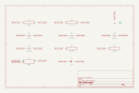

# single_supply

SBOA092B page 76, *Single Supply*: the simple a.c. amplifier above it, with
the + input held at half the supply by R_2 10 kΩ and R_2' 10 kΩ and bypassed
by C_2 100 µF. "Equivalent to above, with the supply 'floated' above ground."

## The circuit



The schematic is compiled from the program and drawn by KiCad, and it opens in
KiCad as [`out/single_supply.kicad_sch`](out/single_supply.kicad_sch). A part with a symbol
of its own is drawn with it; the op amp and the handbook's other parts are
boxes carrying their own pins, and each net is a label rather than a wire.


The interconnect view is fang's own projection. It names the parts as the
program does, so it reads against the code below.

## What the program says

The page gives no supply voltage, so `supply` chooses 15 V and an op amp
that swings from 0 V to 13.5 V on it. The supply is a `Cell` in the graph;
the op amp has no supply pins in this harness, so the rail feeds only the
divider and the swing is set on the model. The claims are the ones
"equivalent to above" implies: gain -10 (`a_v`), a 16 Hz corner (`f_low`,
within 1% of 1/(2 pi R_I C_I)), and a d.c. output of half the supply
(`e_bias`, held to the divider by a constraint).

## What the simulation found

[`out/simulation.txt`](out/simulation.txt):

| Run | Measured | Claimed |
| --- | ---: | ---: |
| `bias`, E_O with no signal | 7.5 V | 7.5 V (`e_bias`), holds |
| `response`, gain at 1 kHz | 9.999 | 10, holds |
| `response`, low -3 dB point | 15.92 Hz | 16 Hz (`f_low`) ±1%, holds |
| `signal`, 0.5 V 1 kHz sine: highest E_O | 12.5 V | 12.5 V, holds |
| `signal`, lowest E_O | 2.501 V | 2.5 V, holds |
| `signal`, mean E_O | 7.5 V | 7.5 V (`e_bias`), holds |

The transient is read over the last 5 ms of 80, after the 10 ms C_I R_I
transient of switching the sine on has settled; read earlier, the mean sits
about 56 mV high.

## Running it

```bash
fang check examples/ti_opamp_handbook/ac_amplifiers/single_supply/single_supply.py
python examples/regenerate.py ti_opamp_handbook/ac_amplifiers/single_supply   # needs ngspice and kicad-cli
```
