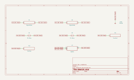

# absolute_value

SBOA092B page 87, *Absolute Value*: two 10 kΩ resistors, two diodes and one op
amp, a follower for +E_I and an inverter for -E_I.

```
E_O = |E_I|
```

## The circuit



The schematic is compiled from the program and drawn by KiCad, and it opens in
KiCad as [`out/absolute_value.kicad_sch`](out/absolute_value.kicad_sch). A part with a symbol
of its own is drawn with it; the op amp and the handbook's other parts are
boxes carrying their own pins, and each net is a label rather than a wire.


The interconnect view is fang's own projection. It names the parts as the
program does, so it reads against the code below.

## What the program says

With R in and R across, the output is 2 V+ - E_I. Both diodes have their
cathodes on the + input, one anode on E_I and one on ground, so the + input
takes the higher of E_I and 0: E_I when it is positive (the output is E_I,
`a_follow = 1`), ground when it is negative (the output is -E_I,
`a_invert = -1`).

## Where the handbook is off

The figure as printed puts E_I, both cathodes and the - input on one node and
the + input on ground. That leaves the left resistor and the upper diode in a
closed loop of their own and the - input held at E_I, and the op amp
saturates. The program records the wiring it simulates as a decision
(`reading`): every part the figure draws, both diodes in their drawn
orientation, with E_I on the upper diode's anode and the left resistor and
the cathodes' node on the + input. Reversing both diodes then gives
-|E_I|, as the page's last sentence says.

## What the simulation found

[`out/simulation.txt`](out/simulation.txt):

| Run | Measured | Claimed |
| --- | ---: | ---: |
| `transfer`, E_I = -5 V | 4.937 V | 5 V ± 0.1 V, holds |
| `transfer`, E_I = -1 V | 0.937 V | 1 V ± 0.1 V, holds |
| `transfer`, E_I = 0 | 0 V | 0 V ± 0.1 V, holds |
| `transfer`, E_I = +1 V | 0.937 V | 1 V ± 0.1 V, holds |
| `transfer`, E_I = +5 V | 4.937 V | 5 V ± 0.1 V, holds |
| `transfer`, E_O / E_I at ±5 V | 0.987, -0.987 | 1, -1 (`a_follow`, `a_invert`) ± 2%, holds |
| `sine`, 2 V at 100 Hz, both half-cycle peaks | 1.936 V | 2 V ± 0.1 V, holds |

This is not a precision circuit. The diodes are outside the loop and the
output is about 63 mV short of |E_I|. It is not a full forward drop: the
+ input draws nothing, so each diode carries only its partner's leakage and
sits at about 31 mV, and the output counts that twice. The + input is a node
only leakage drives, so it lags a fast signal: at 1 kHz the same sine peaked
near 1.89 V. A real op amp's input bias current, which the model does not
have, would move that node by more than the leakage does.

## Running it

```bash
fang check examples/ti_opamp_handbook/additional/absolute_value/absolute_value.py
python examples/regenerate.py ti_opamp_handbook/additional/absolute_value   # needs ngspice and kicad-cli
```
