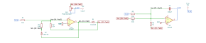
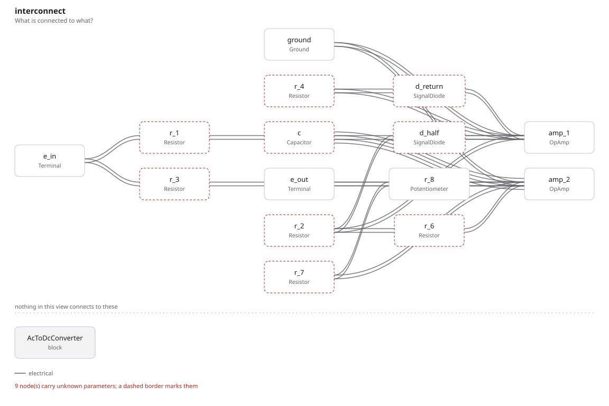

# ac_to_dc_converter

SBOA092B page 88, *AC to DC Converter*: a precision half-wave rectifier (R_1,
R_2, R_4, all 10 kΩ, two diodes) and a summer with a filter across it: E_I
through R_3 (10 kΩ), the half-wave through R_6 (5 kΩ), R_7 (10 kΩ) and a 2 kΩ
rheostat R_8 back from the output, and C (100 µF) across both.

```
E_O average = 0.9 E_I rms,   E_I = 6 mV to 6 V rms at 10 to 1000 Hz
```

## The circuit



The schematic is drawn by [copperhead](https://github.com/copperheadhq/copperhead)'s
drafting engine from this circuit's netlist, with KiCad's own library symbols,
and it opens in KiCad as [`figure/ac_to_dc_converter.kicad_sch`](figure/ac_to_dc_converter.kicad_sch).
The op amp is KiCad's generic one, since the handbook's are ideal, and each
terminal is a test point named as the program names it. KiCad reads back from
the sheet exactly the connections the circuit has; `draw.py` refuses to write
one that does not.



The interconnect view is fang's own projection. It names the parts as the
program does, so it reads against the code below.

## What the program says

The half-wave is -E_I while E_I is positive. Through R_6, half of R_3, it
counts twice, so the summer sees -|E_I| / R_3 on both halves: a full-wave
rectifier, as the page says, whose output C averages. The mean of a full-wave
rectified sine is 2√2/π = 0.9003 of its rms, so a gain of exactly 1 is what
the 0.9 asks for. The program records its reading of the figure (`reading`),
sets R_8 to zero (`trim`: it only adds to R_7, so it trims the gain up for
resistors that come out low, and the simulated ones do not), and holds

```python
require(within(self.k_avg, product(SINE_AVERAGE_OVER_RMS, self.gain), 0.001))
```

with `gain = (R_7 + R_8') / R_3` and a constraint that R_6's weight is twice
R_3's. C against R_7 is 1 s, so each run lasts 10 s and the average is taken
over the last one, with no initial condition to help it along.

## What the simulation found

[`out/simulation.txt`](out/simulation.txt), E_I a 100 Hz sine:

| Run | E_O average | E_O avg / E_I rms | Claimed |
| --- | ---: | ---: | ---: |
| `six_volts`, 6 V rms | 5.400 V | 0.900 | 0.9 (`k_avg`) ± 0.1%, holds |
| `six_millivolts`, 6 mV rms | 5.365 mV | 0.894 | 0.9 ± 1%, holds |

At 6 mV the signal current through R_1 is under 1 µA, and the 1N4148 model's
2.5 nA saturation current through the diode that should be off, with the
junction charge moved at each zero crossing, takes 0.6% of it. The looser
tolerance there is that, and is said beside the claim.

## Running it

```bash
fang check examples/ti_opamp_handbook/additional/ac_to_dc_converter/ac_to_dc_converter.py
python examples/regenerate.py ti_opamp_handbook/additional/ac_to_dc_converter   # needs ngspice
```
