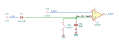

# peak_follower

SBOA092B page 87, *Peak Follower*: E_I through a diode onto a 1 µF capacitor,
a switch across the capacitor to clear it, and a voltage follower reading it.

```
E_O = E_I maximum
```

## The circuit



The schematic is drawn by [copperhead](https://github.com/copperheadhq/copperhead)'s
drafting engine from this circuit's netlist, with KiCad's own library symbols,
and it opens in KiCad as [`figure/peak_follower.kicad_sch`](figure/peak_follower.kicad_sch).
The op amp is KiCad's generic one, since the handbook's are ideal, and each
terminal is a test point named as the program names it. KiCad reads back from
the sheet exactly the connections the circuit has; `draw_figures.py` refuses to write
one that does not.


The interconnect view is fang's own projection. It names the parts as the
program does, so it reads against the code below.

## What the program says

The diode lets the capacitor charge to the highest E_I it has seen and stops
it discharging. It is outside the loop, so its forward drop at the moment
charging stops is subtracted from the peak. The program claims
`e_held = e_peak - v_drop`, a 4 V peak less 0.5 V, and records the drop as a
decision (`drop`) because the figure names no diode and the drop depends on
how the input approaches its peak. The claims are held to 0.1 V.

## Where the handbook is off

E_O is not E_I's maximum: it is a diode drop below it, 0.44 V to 0.48 V here
with a 1N4148 model.

## What the simulation found

[`out/simulation.txt`](out/simulation.txt):

| Run | Measured | Claimed |
| --- | ---: | ---: |
| `pulse`, 3 ms after a 4 V, 1 ms pulse | 3.556 V | 3.5 V (`e_held`) ± 0.1 V, holds |
| `pulse`, 1.9 ms later | 3.556 V | 3.5 V (`e_held`) ± 0.1 V, holds |
| `pulse`, after the reset closes | 0 V | 0 V ± 1 mV, holds |
| `sine`, after ten cycles of 4 V at 1 kHz | 3.517 V | 3.5 V (`e_held`) ± 0.1 V, holds |

The pulse leaves 0.44 V of drop, the diode's voltage at the 45 µA the
capacitor still takes when the pulse ends. The sine tops the capacitor up in
short bursts at each crest and leaves 0.48 V. The model's capacitor does not
leak, so the held value does not droop; the page's advice to use a
low-leakage capacitor is about the part this does not model.

## Running it

```bash
fang check examples/ti_opamp_handbook/additional/peak_follower/peak_follower.py
python examples/regenerate.py ti_opamp_handbook/additional/peak_follower   # needs ngspice
```
