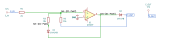

# precision_rectifier

SBOA092B page 88, *Precision Rectifier*: an inverting amplifier with R_I
(2 kΩ) in and two feedback paths, each an R_O (10 kΩ) behind a diode. E_O is
taken from the upper path, between its R_O and its diode.

```
E_O peak = -(R_O / R_I) E_I peak = -5 E_I peak
```

## The circuit



The schematic is drawn by [copperhead](https://github.com/copperheadhq/copperhead)'s
drafting engine from this circuit's netlist, with KiCad's own library symbols,
and it opens in KiCad as [`figure/precision_rectifier.kicad_sch`](figure/precision_rectifier.kicad_sch).
The op amp is KiCad's generic one, since the handbook's are ideal, and each
terminal is a test point named as the program names it. KiCad reads back from
the sheet exactly the connections the circuit has; `draw.py` refuses to write
one that does not.


The interconnect view is fang's own projection. It names the parts as the
program does, so it reads against the code below.

## What the program says

The diodes are the circuit, so the program records its reading of them
(`reading`): both point up the page, the upper from the op amp output to E_O,
the lower from the lower R_O into the output. A positive E_I drives the output
low, the lower path closes the loop, and E_O rests on the virtual ground at
zero. A negative E_I closes the loop through the upper path and E_O = -5 E_I:
the positive hump the page sketches. The claim is `a_v = -5`, held to the
parts by

```python
require(equals(self.a_v, negative(over(self.r_out.resistance, self.r_in.resistance))))
```

## What the simulation found

[`out/simulation.txt`](out/simulation.txt), from the decks under
[`out/spice/`](out/spice/):

| Run | Measured | Claimed |
| --- | ---: | ---: |
| `transfer`, E_O / E_I at E_I = -1 V | -5 | -5 (`a_v`), holds |
| `transfer`, E_O at E_I = +1 V | -19.7 µV | 0 ± 1 mV, holds |
| `half_wave`, peak of E_O, 1 V sine in | 5 V | 5 V, holds |
| `half_wave`, E_O at the positive peak of E_I | -19.8 µV | 0 ± 1 mV, holds |
| `half_wave`, lowest E_O | -8.8 mV | not a claim |

Neither half shows a diode drop: both diodes sit inside the loop. The one
excursion below zero is a spike of a few microseconds at the zero crossing
going positive, while the op amp output swings across two diode drops and the
upper diode recovers.

## Running it

```bash
fang check examples/ti_opamp_handbook/additional/precision_rectifier/precision_rectifier.py
python examples/regenerate.py ti_opamp_handbook/additional/precision_rectifier   # needs ngspice
```
