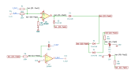

# rate_limiter

SBOA092B page 89, *Rate Limiter*: an op amp with no feedback of its own
comparing E_I + E_O (summed at its + input through R_1 and R_0, both 100 kΩ)
against ground, a diode bridge fed from ±15 V through R_3 and R_4 (100 kΩ), and
an integrator (R_5 100 kΩ, C_0 10 µF) whose output is E_O and closes the loop.

```
E_O = -(R_O / R_I) E_I = -E_I,   rate limit = 7.5 V/s
```

## The circuit



The schematic is drawn by [copperhead](https://github.com/copperheadhq/copperhead)'s
drafting engine from this circuit's netlist, with KiCad's own library symbols,
and it opens in KiCad as [`figure/rate_limiter.kicad_sch`](figure/rate_limiter.kicad_sch).
The op amp is KiCad's generic one, since the handbook's are ideal, and each
terminal is a test point named as the program names it. KiCad reads back from
the sheet exactly the connections the circuit has; `draw_figures.py` refuses to write
one that does not.


The interconnect view is fang's own projection. It names the parts as the
program does, so it reads against the code below.

## What the program says

The reading (`reading`) puts R_0 on the first op amp's + input, where the
integrator's inversion makes the loop negative, and every bridge diode
pointing from the R_3 corner down to the R_4 corner. The supplies are ±15 V
Cells (`supplies`). The loop settles at E_I + E_O = 0; while it is away from
there the first op amp sits on a rail, the bridge cuts one side off, and the
integrator gets what R_3 can push through R_5. Two parameters:

```python
require(equals(self.a_v, negative(over(self.r_0.resistance, self.r_1.resistance))))
require(equals(self.rate_limit, over(self.supply_pos.voltage,
        product(total(self.r_3.resistance, self.r_5.resistance), self.c_0.capacitance))))
```

## What the simulation found

[`out/simulation.txt`](out/simulation.txt):

| Run | Measured | Claimed |
| --- | ---: | ---: |
| `settled`, E_O / E_I at 2 V | -1 | -1 (`a_v`), holds |
| `small_step`, E_O after a 0.1 V step | -100 mV | -100 mV, holds |
| `large_step`, slope of E_O after a 5 V step | 7.268 V/s | 7.5 V/s (`rate_limit`) ± 5%, holds |
| `large_step`, E_O at the end | -5 V | -5 V, holds |

## Where the handbook is off

A little: 7.5 V/s is 15 V / ((R_3 + R_5) C_0), 75 µA into 10 µF, with no
diode drop. The current passes through one bridge diode, which takes about
0.45 V at 73 µA, so the circuit slews at (15 - 0.45) / 200 kΩ / 10 µF =
7.27 V/s, 3% slow. The simulation gives 7.268 V/s. The claim holds the page's
number with a 5% tolerance and says why.

## Running it

```bash
fang check examples/ti_opamp_handbook/additional/rate_limiter/rate_limiter.py
python examples/regenerate.py ti_opamp_handbook/additional/rate_limiter   # needs ngspice
```
