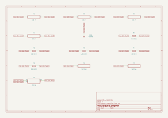

# selective_amplifier

SBOA092B page 91, *Selective Amplifier*: an inverting amplifier with C_I
(50 nF) and R_I (10 kΩ) in series at the input, and R_O (330 kΩ) and a twin-T
notch (R_a 3.3 kΩ, 2 C_a 100 nF; C_a 50 nF, R_a/2 1.65 kΩ) side by side in the
feedback. A notch in the feedback is a peak in the gain.

```
frequency peak = 1 / (2 π R_a C_a) = 1000 Hz
gain at peak = R_O / R_I = 33 = 30 dB
Z_in = R_I = 10 kΩ,   Z_out < 200 Ω
```

## The circuit



The schematic is compiled from the program and drawn by KiCad, and it opens in
KiCad as [`out/selective_amplifier.kicad_sch`](out/selective_amplifier.kicad_sch). A part with a symbol
of its own is drawn with it; the op amp and the handbook's other parts are
boxes carrying their own pins, and each net is a label rather than a wire.


The interconnect view is fang's own projection. It names the parts as the
program does, so it reads against the code below.

## What the program says

It keeps the drawn values and holds four numbers to them: `f_notch`
(1/(2π R_a C_a) = 964.6 Hz), `a_ideal` (R_O / R_I = 33, the page's), `z_in`
(|R_I + 1/(j 2π f C_I)| at the notch, 10.53 kΩ) and `a_notch` (R_O / |Z_in|
there, 31.34). The twin-T's balance (2 C_a, R_a/2) and the page's rule
C_I R_I > 2 C_a R_a (500 µs against 330 µs) are constraints too.

## What the simulation found

[`out/simulation.txt`](out/simulation.txt), a linear sweep 900 Hz to 1050 Hz in
0.05 Hz steps:

| Measured | Value | Claimed |
| --- | ---: | ---: |
| gain at the notch, 964.6 Hz | 31.66 | 31.34 (`a_notch`) ± 2%, holds |
| input impedance at the notch | 10.52 kΩ | 10.53 kΩ (`z_in`) ± 0.5%, holds |
| centre of the -3 dB band | 973.9 Hz | 964.6 Hz (`f_notch`) ± 2%, holds |
| gain at the top of the peak | 44.05 (32.9 dB) | not a claim |
| -3 dB band | 964.3 to 983.6 Hz | not a claim |

The gain climbs 1.6 per hertz at the notch, so 2% there is about 0.2 Hz of
where the simulated notch falls.

## Where the handbook is off

- 1/(2π 3.3 kΩ 50 nF) is 964.6 Hz, not 1000 Hz; the peak itself sits 1% above
  that, at 974 Hz.
- C_I's reactance at the notch is exactly R_a, 3.3 kΩ (C_I equals C_a), so the
  input impedance is 10.53 kΩ, not R_I, and the gain at the notch is 31.3
  (29.9 dB), not 33.
- The top of the peak is higher still, 44 (32.9 dB): a few hertz above the
  notch the twin-T's transfer admittance has a negative real part, which
  cancels part of R_O's conductance. The page's 30 dB is closer to the gain at
  the notch than at the peak.
- Z_out < 200 Ω is not checked: the bench's op amp has an ideal output.

## Running it

```bash
fang check examples/ti_opamp_handbook/additional/selective_amplifier/selective_amplifier.py
python examples/regenerate.py ti_opamp_handbook/additional/selective_amplifier   # needs ngspice and kicad-cli
```
