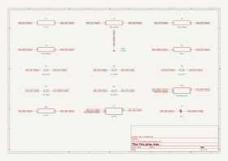

# time_delay_relay

SBOA092B page 90, *Time Delay*: a reset integrator that ramps down from half
the supply and, when it runs out, drops its output onto a clamp and pulls in a
6 V, 1 kΩ relay.

```
Delay = R_I C_O / (2 K),   K the setting of R_7, 0 < K < 1
```

## The circuit



The schematic is compiled from the program and drawn by KiCad, and it opens in
KiCad as [`out/time_delay_relay.kicad_sch`](out/time_delay_relay.kicad_sch). A part with a symbol
of its own is drawn with it; the op amp and the handbook's other parts are
boxes carrying their own pins, and each net is a label rather than a wire.


The interconnect view is fang's own projection. It names the parts as the
program does, so it reads against the code below.

## What the program says

This is the least clean figure in the handbook, and the reading is recorded in
full (`reading`), with the three readings it rejected. As read:

- R_7 across the supply; its wiper through R_1 (100 kΩ) into the - input.
- C_0 (10 µF) from the - input to a node T, which R_5 (10 kΩ) returns to
  ground. C_0 does not go to the output: both crossings on the page are hops.
- A node S, pulled up by R_6 (10 kΩ), feeds T through a diode, and the switch
  connects S to the op amp output.
- R_4 and R_3 from the supply to the output, with a diode from the - input into
  their junction: a clamp about 7.9 V below ground.
- The coil from ground through a diode into S.

Reset (switch open): R_6 and R_5 hold T at 7.2 V and the output sits on its
clamp. Close the switch and the output rises to a diode above T, C_0 becomes
the integrator's capacitor, and T ramps down at K E / (R_1 C_0). When the ramp
can no longer feed R_5 the diode into T lets go, the output falls to its
clamp, S follows it below ground, and about 7 mA flows up through the coil.
E/2 at K E / (R_1 C_0) a second is the page's R_1 C_0 / (2K).

The relay is a `Meter` of 1 kΩ, pulling in when its current passes 4.5 mA, 75%
of rated (`relay`). The supply is 15 V (`supply`). The page's formula is the
parameter `delay`, held by

```python
require(equals(self.delay, over(product(self.r_1.resistance, self.c_0.capacitance),
                                product(2 * ratio, self.r_7.setting))))
```

## What the simulation found

[`out/simulation.txt`](out/simulation.txt), the switch closing at 0.1 s:

| Run | Measured | Claimed |
| --- | ---: | ---: |
| `k_tenth`, K = 0.1, delay to pull-in | 4.753 s | 5 s (`delay`) ± 7%, holds |
| `k_tenth`, coil current during reset | -2.5 nA | 0 ± 10 µA, holds |
| `k_tenth`, coil current as the switch closes | 18 µA | 0 ± 1 mA, holds |
| `k_tenth`, coil current once pulled in | 7.0 mA | not a claim |
| `k_half`, K = 0.5, delay to pull-in | 886 ms | 886 ms (the program's estimate) ± 2%, holds |
| `k_half`, coil current as the switch closes | 18 µA | 0 ± 1 mA, holds |

## Where the handbook is off

The formula is the idealisation, and it runs long. T starts half a diode drop
below E/2, the ramp ends at R_5 K E / R_1 rather than at zero, and the wiper
adds R_7 K (1 - K) to R_1. Together (`shortfall`) they predict 4.75 s at
K = 0.1, 5% under the page's 5 s, and 0.886 s at K = 0.5, 11% under 1 s. The
simulation lands on both. The page's formula is claimed only at K = 0.1, where
it is closest, with a 7% tolerance that says why.

## Running it

```bash
fang check examples/ti_opamp_handbook/additional/time_delay_relay/time_delay_relay.py
python examples/regenerate.py ti_opamp_handbook/additional/time_delay_relay   # needs ngspice and kicad-cli
```
