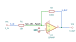

# inverting_amplifier

SBOA092B page 54, *The Inverting Amplifier*: E_I through R_I into the summing
point, R_O from the output back to it, and the non-inverting input on ground.

```
E_O / E_I = -R_O / R_I
```

## The circuit



The schematic is drawn by [copperhead](https://github.com/copperheadhq/copperhead)'s
drafting engine from this circuit's netlist, with KiCad's own library symbols,
and it opens in KiCad as [`figure/inverting_amplifier.kicad_sch`](figure/inverting_amplifier.kicad_sch).
The op amp is KiCad's generic one, since the handbook's are ideal, and each
terminal is a test point named as the program names it. KiCad reads back from
the sheet exactly the connections the circuit has; `draw.py` refuses to write
one that does not.


The interconnect view is fang's own projection. It names the parts as the
program does, so it reads against the code below.

## What the program says

The figure names the two resistors and gives them no values, so the program
chooses them and records the choice as a decision (`values`): 10 kΩ in and
100 kΩ across, for a gain of -10. The claim is a parameter, `a_v = -10`, and
one constraint holds it to the parts:

```python
require(equals(self.a_v, negative(over(self.r_out.resistance, self.r_in.resistance))))
```

Change either resistor and the check fails until `a_v` agrees.

## What the simulation found

[`out/simulation.txt`](out/simulation.txt), from the two decks under
[`out/spice/`](out/spice/):

| Run | Measured | Claimed |
| --- | ---: | ---: |
| `gain`, operating point, E_I = 1 V | -10 | -10 (`a_v`), holds |
| `bandwidth`, gain at 1 kHz | 10 | 10, holds |
| `bandwidth`, -3 dB point | 906.9 kHz | not a claim |

The handbook's algebra lets the open-loop gain go to infinity. The bench's op
amp has 120 dB of it and 10 MHz of gain-bandwidth, so the DC gain lands within
a part in 10^5 of -10, and the closed loop runs out near 10 MHz / 11, the
noise gain. That corner is the op amp's, not a claim of the handbook.

## Running it

```bash
fang check examples/ti_opamp_handbook/basic_amplifiers/inverting_amplifier/inverting_amplifier.py
python examples/regenerate.py ti_opamp_handbook/basic_amplifiers/inverting_amplifier   # needs ngspice
```
