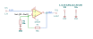

# noninverting_amplifier

SBOA092B page 53, *The Non-Inverting Amplifier*: E_I on the non-inverting
input, R_O from the output to the inverting input and R_I from there to
ground.

```
E_O / E_I = (R_O + R_I) / R_I = 1 + R_O / R_I
```

## The circuit



The schematic is drawn by [copperhead](https://github.com/copperheadhq/copperhead)'s
drafting engine from this circuit's netlist, with KiCad's own library symbols,
and it opens in KiCad as [`figure/noninverting_amplifier.kicad_sch`](figure/noninverting_amplifier.kicad_sch).
The op amp is KiCad's generic one, since the handbook's are ideal, and each
terminal is a test point named as the program names it. KiCad reads back from
the sheet exactly the connections the circuit has; `draw_figures.py` refuses to write
one that does not.


The interconnect view is fang's own projection. It names the parts as the
program does, so it reads against the code below.

## What the program says

The figure names the two resistors and gives them no values, so the program
chooses them and records the choice (`values`): 10 kΩ and 90 kΩ, for a gain
of +10. The claim is a parameter, `a_v = 10`, and one constraint holds it to
the parts:

```python
require(equals(self.a_v, total(1 * ratio, over(self.r_out.resistance, self.r_in.resistance))))
```

## What the simulation found

[`out/simulation.txt`](out/simulation.txt):

| Run | Measured | Claimed |
| --- | ---: | ---: |
| `gain`, operating point, E_I = 1 V | 10 | 10 (`a_v`), holds |
| `bandwidth`, gain at 1 kHz | 10 | 10 (`a_v`), holds |
| `bandwidth`, -3 dB point | 997.6 kHz | not a claim |

Here the noise gain is the signal gain, 10, so the 10 MHz op amp closes near
1 MHz. That corner is the op amp's, not a claim of the handbook.

## Running it

```bash
fang check examples/ti_opamp_handbook/basic_amplifiers/noninverting_amplifier/noninverting_amplifier.py
python examples/regenerate.py ti_opamp_handbook/basic_amplifiers/noninverting_amplifier   # needs ngspice
```
