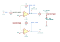

# balanced_output

SBOA092B page 50, *Balanced Output*: two unity-gain inverters (10 kΩ / 10 kΩ
each) in cascade. The first one's output is the terminal labelled E_O+, the
second one's is E_O-.

```
E_O+ = -E_I,   E_O- = +E_I,   E_O+ - E_O- = -2 E_I
```

## The circuit



The schematic is drawn by [copperhead](https://github.com/copperheadhq/copperhead)'s
drafting engine from this circuit's netlist, with KiCad's own library symbols,
and it opens in KiCad as [`figure/balanced_output.kicad_sch`](figure/balanced_output.kicad_sch).
The op amp is KiCad's generic one, since the handbook's are ideal, and each
terminal is a test point named as the program names it. KiCad reads back from
the sheet exactly the connections the circuit has; `draw_figures.py` refuses to write
one that does not.


The interconnect view is fang's own projection. It names the parts as the
program does, so it reads against the code below.

## What the program says

Every value is drawn, so nothing is chosen. The parameters are the two gains
(`a_plus = -1`, `a_minus = +1`), their difference (`a_diff = -2`) and the p-p
swing of E_O+ measured against E_O-, per volt of input peak
(`pp_per_peak = 4`). Each is tied to the resistors.

## What the simulation found

[`out/simulation.txt`](out/simulation.txt):

| Run | Measured | Claimed |
| --- | ---: | ---: |
| `dc_gains`, E_O+ / E_I | -1 | -1 (`a_plus`), holds |
| `dc_gains`, E_O- / E_I | 1 | 1 (`a_minus`), holds |
| `dc_gains`, (E_O+ - E_O-) / E_I | -2 | -2 (`a_diff`), holds |
| `sine_1v_peak`, p-p of E_O+ - E_O- | 4 V | 4 (`pp_per_peak`), holds |
| `sine_1v_peak`, p-p of E_O+ against ground | 2 V | 2 V, holds |
| `sine_10v_peak`, p-p of E_O+ - E_O- | 40 V | 40 V, holds |
| `sine_10v_peak`, p-p of E_O+ against ground | 20 V | 20 V, holds |

The p-p of the difference is measured through a unit-gain VCVS card, because
ngspice's `meas` reads a single vector.

## What the text's "4E_I" means

The text says that using E_O- as the reference, a p-p swing of 4E_I is
obtainable at E_O+. That holds with E_I read as the input's peak: a sine of
peak E_I takes E_O+ - E_O- from -2E_I to +2E_I. Against ground, E_O+ swings
only 2E_I p-p, the same as the input. The "swing greater than the rails" also
holds: at 10 V peak the difference spans 40 V p-p while each output stays at
±10 V, and with ±13.5 V of swing on each it could span 54 V. The text's
"E_O- terminal at the reference" reads as "as the reference".

## Running it

```bash
fang check examples/ti_opamp_handbook/buffers/balanced_output/balanced_output.py
python examples/regenerate.py ti_opamp_handbook/buffers/balanced_output   # needs ngspice
```
