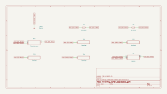

# inverting_buffer_adjustable_gain

SBOA092B page 50, *Inverting Buffer Adjustable Gain*: E_I through R_I
(10 kΩ), a 100 Ω potentiometer and R_O (10 kΩ) in a row to the output, with
the pot's wiper on the inverting input.

The handbook prints no formula. The drawing's, with s the wiper's position
from the R_I end:

```
E_O / E_I = -(R_O + (1 - s) R_2) / (R_I + s R_2)
```

## The circuit



The schematic is compiled from the program and drawn by KiCad, and it opens in
KiCad as [`out/inverting_buffer_adjustable_gain.kicad_sch`](out/inverting_buffer_adjustable_gain.kicad_sch). A part with a symbol
of its own is drawn with it; the op amp and the handbook's other parts are
boxes carrying their own pins, and each net is a label rather than a wire.


The interconnect view is fang's own projection. It names the parts as the
program does, so it reads against the code below.

## What the program says

The figure leaves the wiper's position open, so the program records a choice
(`trim`): the centre, where both sides are 10.05 kΩ and the gain is exactly
-1 (`a_v`). Two more parameters hold the ends of the trim: -1.01 with the
wiper at the R_I end (`a_v_input_end`) and -0.990099 at the R_O end
(`a_v_output_end`). All three are tied to the parts by the same function of
the pot's setting, so a different pot or resistor fails the check.

## What the simulation found

[`out/simulation.txt`](out/simulation.txt):

| Run | Pot setting | Measured | Claimed |
| --- | ---: | ---: | ---: |
| `centre` | 0.5 | -1 | -1 (`a_v`), holds |
| `wiper_at_input_end` | 0 | -1.01 | -1.01 (`a_v_input_end`), holds |
| `wiper_at_output_end` | 1 | -0.9901 | -0.990099 (`a_v_output_end`), holds |

A 100 Ω pot between two 10 kΩ resistors trims the gain by about ±1%, which
covers the mismatch of two 0.5% resistors.

## Running it

```bash
fang check examples/ti_opamp_handbook/buffers/inverting_buffer_adjustable_gain/inverting_buffer_adjustable_gain.py
python examples/regenerate.py ti_opamp_handbook/buffers/inverting_buffer_adjustable_gain   # needs ngspice and kicad-cli
```
