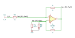

# current_injector

SBOA092B page 80, *Current Injector*: a Howland current source. E_I through
R1 into the - input, R0 from the output back to it; R3 from the output to
the + input, R2 from there to ground, and the load R_L from there to ground.
All four resistors are 1 kΩ.

```
I = -E_I / R_L = -E_I mA,    R1 / R2 = R0 / R3
```

## The circuit



The schematic is drawn by [copperhead](https://github.com/copperheadhq/copperhead)'s
drafting engine from this circuit's netlist, with KiCad's own library symbols,
and it opens in KiCad as [`figure/current_injector.kicad_sch`](figure/current_injector.kicad_sch).
The op amp is KiCad's generic one, since the handbook's are ideal, and each
terminal is a test point named as the program names it. KiCad reads back from
the sheet exactly the connections the circuit has; `draw.py` refuses to write
one that does not.


The interconnect view is fang's own projection. It names the parts as the
program does, so it reads against the code below.

## What the program says

With the + input at V_P, the current delivered into the load is

```
I = -R0 E_I / (R1 R3) + V_P (R0 / (R1 R3) - 1 / R2)
```

and the page's ratio condition makes the bracket zero, so I = -R0 E_I /
(R1 R3) = -E_I / R2, whatever R_L is. The program holds the ratio condition
and the transconductance as constraints, and makes the load a `Load` a run
can change (`load` records the values).

## What the simulation found

[`out/simulation.txt`](out/simulation.txt), E_I = 1 V:

| R_L | I / E_I | + input | Output |
| ---: | ---: | ---: | ---: |
| 100 Ω | -1 mA/V, holds | -0.1 V | -1.2 V |
| 1 kΩ | -1 mA/V, holds | -1 V | -3 V |
| 4.7 kΩ | -1 mA/V, holds | -4.7 V | -10.4 V |

The + input swings with the load, which is the common-mode limit the page
warns about: at 10 kΩ the output would need -21 V.

## Where the handbook is off

The page prints I = -E_I / R_L. A current that depended on R_L would not be a
current source. For the drawn circuit it is -R0 E_I / (R1 R3), or -E_I / R2;
with 1 kΩ throughout that is the -E_I mA the page prints, so the number is
right and the formula is not.

## Running it

```bash
fang check examples/ti_opamp_handbook/current_output/current_injector/current_injector.py
python examples/regenerate.py ti_opamp_handbook/current_output/current_injector   # needs ngspice
```
