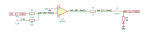
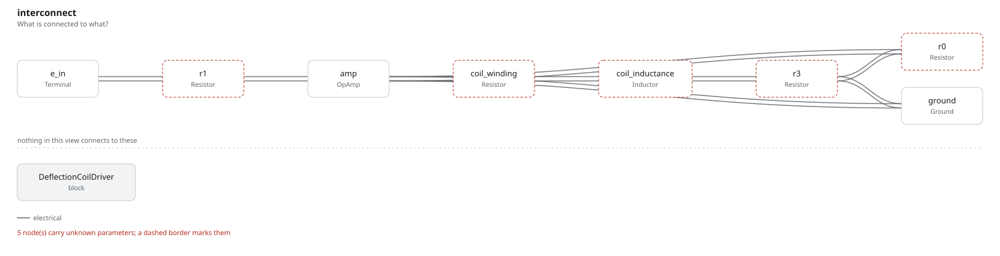

# deflection_coil_driver

SBOA092B page 82, *Deflection Coil Driver*: an inverting amplifier (R1 and
R0, 10 kΩ each) whose feedback is taken from the top of R3 (10 Ω), with the
floating load between the output and R3.

```
I / E_I = -R0 / (R1 R3) = -100 mA / Volt
```

## The circuit



The schematic is drawn by [copperhead](https://github.com/copperheadhq/copperhead)'s
drafting engine from this circuit's netlist, with KiCad's own library symbols,
and it opens in KiCad as [`figure/deflection_coil_driver.kicad_sch`](figure/deflection_coil_driver.kicad_sch).
The op amp is KiCad's generic one, since the handbook's are ideal, and each
terminal is a test point named as the program names it. KiCad reads back from
the sheet exactly the connections the circuit has; `draw_figures.py` refuses to write
one that does not.



The interconnect view is fang's own projection. It names the parts as the
program does, so it reads against the code below.

## What the program says

The loop holds the top of R3 at -E_I R0 / R1, so R3 carries -E_I R0 /
(R1 R3). The load also carries the E_I / R1 that R0 takes from the same
node, so the coil current is -(R0 / (R1 R3) + 1 / R1) E_I = -100.1 mA per
volt, and that is the constraint. The figure draws R_L as a resistor; the
program makes it a coil, 10 mH in series with 5 Ω of winding (`coil`), whose
80 Hz corner is what a current drive is for.

## What the simulation found

[`out/simulation.txt`](out/simulation.txt):

| Run | Measured | Claimed |
| --- | ---: | ---: |
| `dc`, E_I = 1 V | -100.1 mA/V | -100.1 mA/V (`i_per_volt`) ±0.1%, holds |
| `sine`, 0.5 V peak at 1 kHz, peak to peak | -100.3 mA/V | -100.1 mA/V ±0.5%, holds |
| `sine`, lag of the coil current behind the input | 27 ns | 0 ±1 µs, holds |

A voltage across the same coil at 1 kHz would drive a current lagging by 85
degrees, 236 µs. The loop drives 63 Ω of reactance with 3.4 V and the current
keeps up; the 0.2% it gains in amplitude is the loop gain, a few hundred at
1 kHz once the coil divides what comes back.

## Where the handbook is off

Slightly: -100 mA / Volt is the current through R3. The coil also carries
E_I / R1, 0.1 mA per volt more, so the load current is -100.1 mA / Volt.

## Running it

```bash
fang check examples/ti_opamp_handbook/current_output/deflection_coil_driver/deflection_coil_driver.py
python examples/regenerate.py ti_opamp_handbook/current_output/deflection_coil_driver   # needs ngspice
```
