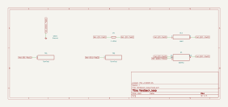
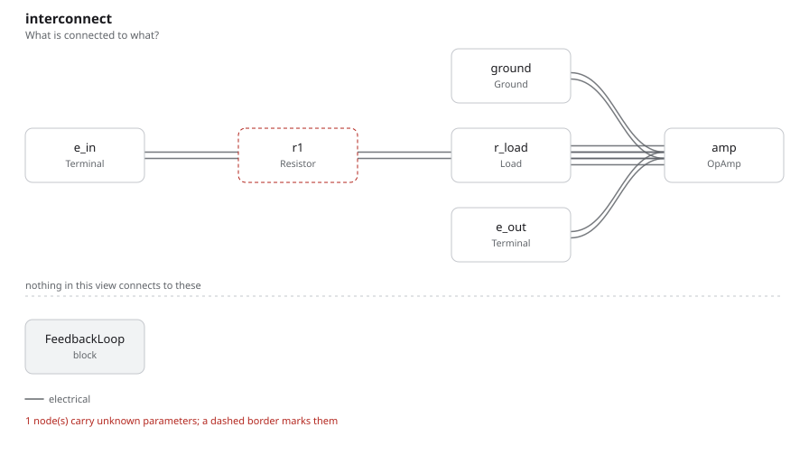

# feedback_loop

SBOA092B page 79, *Feedback Loop*: E_I through R1 (1 kΩ) into the summing
point, and the load R_L from there to the output, where an inverting
amplifier's feedback resistor would be. The + input is on ground.

```
I = E_I / R1 = E_I mA,    Z_in = R1 = 1 kΩ
```

## The circuit



The schematic is compiled from the program and drawn by KiCad, and it opens in
KiCad as [`out/feedback_loop.kicad_sch`](out/feedback_loop.kicad_sch). A part with a symbol
of its own is drawn with it; the op amp and the handbook's other parts are
boxes carrying their own pins, and each net is a label rather than a wire.



The interconnect view is fang's own projection. It names the parts as the
program does, so it reads against the code below.

## What the program says

The summing point sits at ground, so the current through R1 is E_I / R1, and
it has nowhere to go but through the load. The figure draws R_L between two
terminals with no value, so the program makes it a `Load` a run can change,
and records the values used as a decision (`load`). The two claims are
parameters tied to R1:

```python
require(equals(self.i_per_volt, over(1 * ratio, self.r1.resistance)))
require(equals(self.z_in, self.r1.resistance))
```

## What the simulation found

[`out/simulation.txt`](out/simulation.txt), E_I = 1 V throughout:

| R_L | I / E_I | Z_in | E_O |
| ---: | ---: | ---: | ---: |
| 100 Ω | 1 mA/V, holds | 1 kΩ, holds | -0.1 V |
| 1 kΩ | 1 mA/V, holds | 1 kΩ, holds | -1 V |
| 10 kΩ | 1 mA/V, holds | 1 kΩ, holds | -10 V |
| 20 kΩ | 0.69 mA/V, not a claim | | -13.5 V, claimed, holds |

The current does not move with the load until the output runs out of swing.
At 20 kΩ the load needs -20 V; the output stops at -13.5 V and the current
falls to 14.5 V / 21 kΩ.

## Running it

```bash
fang check examples/ti_opamp_handbook/current_output/feedback_loop/feedback_loop.py
python examples/regenerate.py ti_opamp_handbook/current_output/feedback_loop   # needs ngspice and kicad-cli
```
