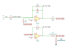

# linear_current_source

SBOA092B page 81, *Linear Current Source*, and its Table 2. The first op amp
sums E_I (through R1) and the load voltage (through the upper R2) against R0,
with C_O across R0; the second inverts its output; R3 runs from the second
output into the load.

```
When R_L << R2,   I_L / E_I = R2 / (R1 R3) = 1 mA / Volt
```

## The circuit



The schematic is drawn by [copperhead](https://github.com/copperheadhq/copperhead)'s
drafting engine from this circuit's netlist, with KiCad's own library symbols,
and it opens in KiCad as [`figure/linear_current_source.kicad_sch`](figure/linear_current_source.kicad_sch).
The op amp is KiCad's generic one, since the handbook's are ideal, and each
terminal is a test point named as the program names it. KiCad reads back from
the sheet exactly the connections the circuit has; `draw_figures.py` refuses to write
one that does not.


The interconnect view is fang's own projection. It names the parts as the
program does, so it reads against the code below.

## What the program says

The second output is R2 E_I / R1 + V_L, so the current R3 delivers is
R2 E_I / (R1 R3) whatever V_L is. The upper R2 takes V_L / R2 of it back,
which is the "R_L << R2" condition: 0.1% for the 100 Ω load chosen. Table 2
changes R3 alone, so R3 is a part a run can change. C_O has no value in the
figure; `c_o_value` records 100 pF, and `load` records the 100 Ω load.

## What the simulation found

[`out/simulation.txt`](out/simulation.txt):

| Run | R3 | I_L / E_I | Claimed (Table 2) |
| --- | ---: | ---: | ---: |
| `r3_1000_ohm` | 1 kΩ | 0.999 mA/V | 1 mA/V (`i_per_volt`) ±0.2%, holds |
| `r3_100_ohm` | 100 Ω | 9.99 mA/V | 10 mA/V ±0.2%, holds |
| `r3_10_ohm` (E_I = 100 mV) | 10 Ω | 99.89 mA/V | 100 mA/V ±0.2%, holds |
| `step`, 1 V step, current at 500 µs | 1 kΩ | 0.999 mA, no overshoot | holds |

Every row is low by R_L / R2, the current the upper R2 takes back.

## Running it

```bash
fang check examples/ti_opamp_handbook/current_output/linear_current_source/linear_current_source.py
python examples/regenerate.py ti_opamp_handbook/current_output/linear_current_source   # needs ngspice
```
