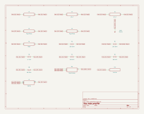

# meter_amplifier

SBOA092B page 80, *Meter Amplifier*, "fully developed average reading
meter": a follower whose feedback current runs through a bridge of two
diodes and two 10 µF capacitors, with the meter across it.

```
Meter reading = 0.9 E_I / (R4 + R5)   (E_I rms)
```

## The circuit



The schematic is compiled from the program and drawn by KiCad, and it opens in
KiCad as [`out/meter_amplifier.kicad_sch`](out/meter_amplifier.kicad_sch). A part with a symbol
of its own is drawn with it; the op amp and the handbook's other parts are
boxes carrying their own pins, and each net is a label rather than a wire.


The interconnect view is fang's own projection. It names the parts as the
program does, so it reads against the code below.

## What the program says

E_I comes in through a 1 µF capacitor onto the + input (220 kΩ to ground).
The - input follows it, so E_I / (R4 + R5) flows through R4 (47 Ω) and the
R5 rheostat to ground, and the output supplies it through the bridge. The
output is the bridge's top corner; one diode leads from it to the right
corner and another from the left corner up to it; the capacitors join both
corners to the bottom corner, which is the - input. R0 (220 kΩ) closes the
loop at d.c. The meter, with R8 (68 kΩ) across it, sits between the right
and left corners through R7 and R6.

The positive half of the current leaves through the right diode, the
negative half comes back through the left one, and the capacitors pass both.
What reaches the meter is the d.c. circulating through the two diodes in
series, which is one diode's average: half a cycle of the current. For a sine
that is 0.45 E_I rms / (R4 + R5). The constraint says so:

```python
require(equals(self.reading_per_volt, over(0.45, total(self.r4.resistance, in_circuit))))
```

Decisions recorded: `names` (the figure labels two capacitors C1), `movement`
(a 100 Ω, 1 mA meter) and `calibration` (R5 at 53 Ω, so R4 + R5 = 100 Ω).

## What the simulation found

[`out/simulation.txt`](out/simulation.txt), 100 mV rms at 1 kHz:

| Run | Meter average / E_I rms | Claimed |
| --- | ---: | ---: |
| `sine`, R4 + R5 = 100 Ω | 4.479 mA/V | 4.5 mA/V (`reading_per_volt`) ±1%, holds |
| `calibration`, R4 + R5 = 147 Ω | 3.043 mA/V | 3.061 mA/V ±1%, holds |

The 0.5% shortfall is R0 and R8, which take a little of the current.

## Where the handbook is off

The page prints 0.9 E_I / (R4 + R5), the full-wave average of a sine over
its rms. The drawn bridge has two diodes and two capacitors, not four
diodes, and its meter carries half that: 0.45 E_I / (R4 + R5), which is what
ngspice measures. A four-diode bridge would read 0.9.

## Running it

```bash
fang check examples/ti_opamp_handbook/current_output/meter_amplifier/meter_amplifier.py
python examples/regenerate.py ti_opamp_handbook/current_output/meter_amplifier   # needs ngspice and kicad-cli
```
