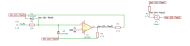
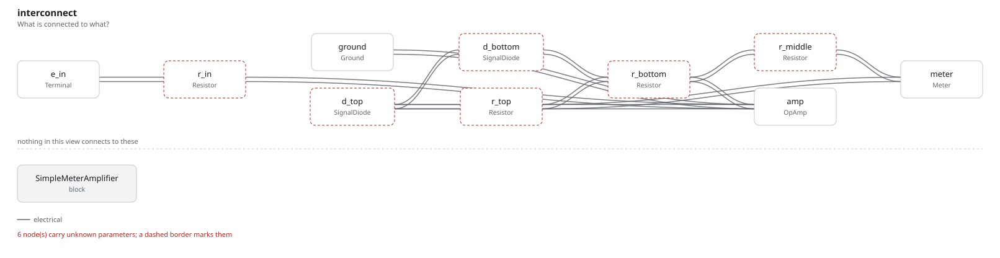

# simple_meter_amplifier

SBOA092B page 79, *Simple Meter Amplifier*: E_I through R_I (10 kΩ) into the
summing point, and a bridge from the output back to it: two diodes on the
summing-point side, a 4.7 kΩ R_O on each of the other two, and the meter in
series with a third R_O across the middle.

```
I_meter = E_I / (3 R_I) = E_I / 30 mA
```

## The circuit



The schematic is drawn by [copperhead](https://github.com/copperheadhq/copperhead)'s
drafting engine from this circuit's netlist, with KiCad's own library symbols,
and it opens in KiCad as [`figure/simple_meter_amplifier.kicad_sch`](figure/simple_meter_amplifier.kicad_sch).
The op amp is KiCad's generic one, since the handbook's are ideal, and each
terminal is a test point named as the program names it. KiCad reads back from
the sheet exactly the connections the circuit has; `draw.py` refuses to write
one that does not.



The interconnect view is fang's own projection. It names the parts as the
program does, so it reads against the code below.

## What the program says

Whichever way the input current flows, one diode carries it and the meter
takes the share that goes round through the middle branch, always in the
same direction. That share is R_O / (3 R_O + R_M), which is the handbook's
third only when the meter's own resistance R_M is small. Two things are
recorded as decisions:

- `diodes`: the diode symbols are too small to read. The program takes the
  upper diode pointing into the summing point and the lower one out of it;
  the other workable reading only reverses the meter.
- `movement`: the meter is 100 Ω, which keeps its share within 1% of a third.

`g_meter` is the meter's average current per volt of rectified input for the
drawn circuit, and `g_handbook` is the page's 1 / (3 R_I); a constraint holds
the two within 1% of each other.

## What the simulation found

[`out/simulation.txt`](out/simulation.txt), a 100 Hz sine of 1 V peak, four
periods averaged:

| Measured | Value | Claimed |
| --- | ---: | ---: |
| meter average / average of \|E_I\| | 33.10 µA/V | 33.10 µA/V (`g_meter`), holds |
| the same, against the handbook | 33.10 µA/V | 33.33 µA/V (`g_handbook`) ±1%, holds |
| meter average current | 21.07 µA | not a claim |

The meter reads the full-wave average of the input: 2/π of 1 V peak over
30.2 kΩ.

## Running it

```bash
fang check examples/ti_opamp_handbook/current_output/simple_meter_amplifier/simple_meter_amplifier.py
python examples/regenerate.py ti_opamp_handbook/current_output/simple_meter_amplifier   # needs ngspice
```
