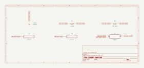

# chopper_stabilized

SBOA092B page 70, *Chopper Stabilized*: the simple inverting amplifier above
it (R_I = 1 kΩ, R_O = 100 kΩ, + input on ground) with the op amp named, a
TLC265x chopper-stabilized part. The page claims only "improved drift and
stability".

```
E_O = -(R_O / R_I) E_I = -100 E_I
```

## The circuit



The schematic is compiled from the program and drawn by KiCad, and it opens in
KiCad as [`out/chopper_stabilized.kicad_sch`](out/chopper_stabilized.kicad_sch). A part with a symbol
of its own is drawn with it; the op amp and the handbook's other parts are
boxes carrying their own pins, and each net is a label rather than a wire.


The interconnect view is fang's own projection. It names the parts as the
program does, so it reads against the code below.

## What the program says

In a DC amplifier, drift shows up as the input offset voltage multiplied by
the noise gain, 1 + R_O/R_I = 101 (not the signal gain of 100). The page gives
no offsets, so the program chooses two (`offsets`): 1 µV for the TLC2652, its
datasheet maximum at 25 °C, set on the op amp part; and 2 mV for a
general-purpose op amp in the same socket, which stands for the class rather
than a named part. The model carries an offset at one temperature and no
temperature coefficient, so the comparison is of offsets, and drift is those
offsets moving.

The constraints hold `a_v = -R_O/R_I`, `noise_gain = 1 + R_O/R_I`, and each
output error to its offset times the noise gain.

## What the simulation found

[`out/simulation.txt`](out/simulation.txt), from the decks under
[`out/spice/`](out/spice/):

| Run | Measured | Claimed |
| --- | ---: | ---: |
| `gain`, E_I = 0.1 V | -99.99 | -100 (`a_v`) ± 0.1%, holds |
| `offset_chopper`, E_I = 0, 1 µV offset: abs(E_O) | 101 µV | 101 µV (`error_chopper`), holds |
| `offset_general`, E_I = 0, 2 mV offset: abs(E_O) | 202 mV | 202 mV (`error_general`), holds |

The general-purpose part's error is 2000 times the chopper's, and at a gain of
100 it is already 2% of full scale for a 0.1 V input.

## Running it

```bash
fang check examples/ti_opamp_handbook/dc_amplifiers/chopper_stabilized/chopper_stabilized.py
python examples/regenerate.py ti_opamp_handbook/dc_amplifiers/chopper_stabilized   # needs ngspice and kicad-cli
```
