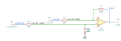
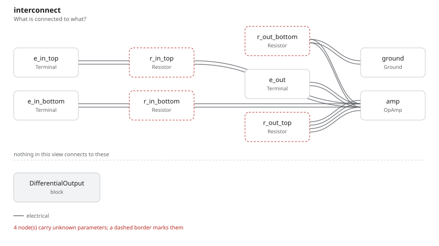

# differential_output

SBOA092B page 73, *Differential Output*: E_I between two input terminals,
one through R_I 10 kΩ to the - input with R_O 100 kΩ back from the output,
the other through R_I 10 kΩ to the + input with R_O 100 kΩ from there to
ground. E_O is taken from the output to ground.

```
E_O = R_O / R_I x E_I = 10 E_I      "For driving floating load."
```

## The circuit



The schematic is drawn by [copperhead](https://github.com/copperheadhq/copperhead)'s
drafting engine from this circuit's netlist, with KiCad's own library symbols,
and it opens in KiCad as [`figure/differential_output.kicad_sch`](figure/differential_output.kicad_sch).
The op amp is KiCad's generic one, since the handbook's are ideal, and each
terminal is a test point named as the program names it. KiCad reads back from
the sheet exactly the connections the circuit has; `draw_figures.py` refuses to write
one that does not.



The interconnect view is fang's own projection. It names the parts as the
program does, so it reads against the code below.

## What the program says

Two readings are recorded as decisions. `reading`: the drawing is a
difference amplifier whose input floats; its output is single-ended, so the
program follows the drawing and not the title or caption. `polarity`: the
figure marks none, and E_O = +10 E_I holds with E_I positive at the bottom
terminal, the one that reaches the + input. Two constraints hold the gain
and the match of the two pairs that makes it a difference gain:

```python
require(equals(self.a_v, over(self.r_out_top.resistance, self.r_in_top.resistance)))
require(equals(over(self.r_out_bottom.resistance, self.r_in_bottom.resistance),
               over(self.r_out_top.resistance, self.r_in_top.resistance)))
```

## What the simulation found

[`out/simulation.txt`](out/simulation.txt), operating points:

| Run | Drive (top, bottom) | Measured | Claimed |
| --- | --- | ---: | ---: |
| `floating` | -0.5 V, +0.5 V | gain 10 | 10 (`a_v`), holds |
| `offset_source` | 3 V, 4 V | gain 10 | 10 (`a_v`), holds |
| `common_mode` | 1 V, 1 V | E_O ≈ 0 V | 0 V, holds |

## Where the handbook is off

The title and "for driving floating load" describe a circuit with a floating
output. The figure has one op amp and one output referred to ground; what
floats is the input. The formula is right for the drawn circuit, with E_I
taken positive at the terminal that feeds the + input.

## Running it

```bash
fang check examples/ti_opamp_handbook/dc_amplifiers/differential_output/differential_output.py
python examples/regenerate.py ti_opamp_handbook/dc_amplifiers/differential_output   # needs ngspice
```
