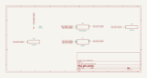

# gain_control

SBOA092B page 73, *Gain Control*: E_I on the + input, a 10 kΩ potentiometer
from the output to ground, and its wiper on the - input.

```
E_O / E_I = 1 / k,   k = the fraction of the pot below the wiper
```

The page prints no formula, only that this is the non-inverting amplifier
with both resistors replaced by the pot; 1/k is that formula with
R_O = (1 - k) R and R_I = k R.

## The circuit



The schematic is compiled from the program and drawn by KiCad, and it opens in
KiCad as [`out/gain_control.kicad_sch`](out/gain_control.kicad_sch). A part with a symbol
of its own is drawn with it; the op amp and the handbook's other parts are
boxes carrying their own pins, and each net is a label rather than a wire.


The interconnect view is fang's own projection. It names the parts as the
program does, so it reads against the code below.

## What the program says

`setting` records that the pot's setting counts from the grounded end, so it
is k itself, and that the claim is held at k = 0.1, a gain of 10. One
constraint:

```python
require(equals(self.a_v, over(1 * ratio, self.pot.setting)))
```

## What the simulation found

[`out/simulation.txt`](out/simulation.txt), operating points:

| k | E_I | Gain | Claimed |
| ---: | ---: | ---: | ---: |
| 0.1 | 1 V | 10 | 10 (`a_v`), holds |
| 1 | 1 V | 1 | 1, holds |
| 0.5 | 1 V | 2 | 2, holds |
| 0.25 | 1 V | 4 | 4, holds |
| 0.02 | 0.2 V | 50 | 50, holds |

At k = 0.02 the drive is cut to 0.2 V so that E_O, 10 V, stays inside the
swing. The gain is not linear in the setting, and it heads for infinity as
the wiper nears ground.

## Running it

```bash
fang check examples/ti_opamp_handbook/dc_amplifiers/gain_control/gain_control.py
python examples/regenerate.py ti_opamp_handbook/dc_amplifiers/gain_control   # needs ngspice and kicad-cli
```
