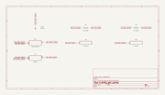
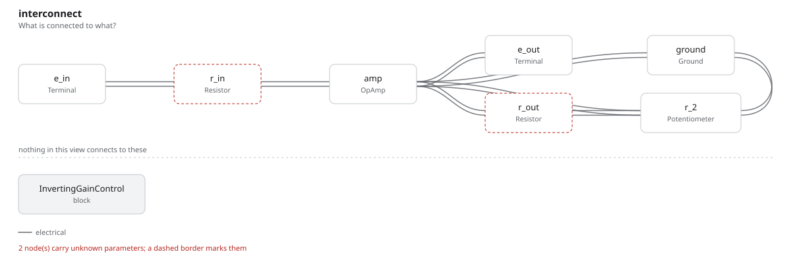

# inverting_gain_control

SBOA092B page 73, *Inverting Gain Control*: R_I 10 kΩ into the summing point,
R_O 10 kΩ from there to the wiper of R_2, a 10 kΩ pot from the output to
ground. A T network in the feedback.

```
E_O = (-1 to infinity) E_I,   Z_in = 10 kΩ
```

## The circuit



The schematic is compiled from the program and drawn by KiCad, and it opens in
KiCad as [`out/inverting_gain_control.kicad_sch`](out/inverting_gain_control.kicad_sch). A part with a symbol
of its own is drawn with it; the op amp and the handbook's other parts are
boxes carrying their own pins, and each net is a label rather than a wire.



The interconnect view is fang's own projection. It names the parts as the
program does, so it reads against the code below.

## What the program says

The page gives only the range, so the program derives the gain (`t_network`).
With R_a the part of R_2 between output and wiper and R_b the part below the
wiper, the wiper sits at -(R_O / R_I) E_I, and

```
E_O / E_I = -(R_O / R_I) (1 + R_a / R_b + R_a / R_O)
```

With R_O = R_2 and the setting s counted from the output end, that is
-(1 / (1 - s) + s): -1 at s = 0, infinite at s = 1. `setting` records that
choice and holds the claim at s = 0.5, a gain of -2.5. The constraint writes
the formula out over the parts, and a second holds Z_in to R_I.

## What the simulation found

[`out/simulation.txt`](out/simulation.txt), operating points:

| s | E_I | Gain | Claimed | Z_in |
| ---: | ---: | ---: | ---: | ---: |
| 0.5 | 1 V | -2.5 | -2.5 (`a_v`), holds | 10 kΩ, holds |
| 0 | 1 V | -1 | -1, holds | 10 kΩ, holds |
| 0.8 | 1 V | -5.8 | -5.8, holds | 10 kΩ, holds |
| 0.9 | 1 V | -10.9 | -10.9, holds | 10 kΩ, holds |
| 0.95 | 0.5 V | -20.95 | -20.95, holds | 10 kΩ, holds |

The wiper sits at -1 V for E_I = 1 V whatever the setting, and Z_in stays
10 kΩ. The bench stays off the infinite end, where any E_I saturates the
output; at s = 0.95 the drive is halved to keep E_O inside the swing.

## Running it

```bash
fang check examples/ti_opamp_handbook/dc_amplifiers/inverting_gain_control/inverting_gain_control.py
python examples/regenerate.py ti_opamp_handbook/dc_amplifiers/inverting_gain_control   # needs ngspice and kicad-cli
```
