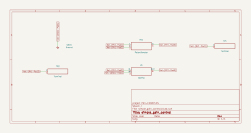

# simple_gain_control

SBOA092B pages 70 and 71, *Simple Gain Control*: one 10 kΩ potentiometer with
one end at E_I, the other at E_O, and its wiper on the inverting input; the
non-inverting input on ground. The page says: "Wide range gain or attenuation.
Unity gain with R centered. The gain is not linear with potentiometer setting.
Z_in drops as gain is increased."

## The circuit



The schematic is compiled from the program and drawn by KiCad, and it opens in
KiCad as [`out/simple_gain_control.kicad_sch`](out/simple_gain_control.kicad_sch). A part with a symbol
of its own is drawn with it; the op amp and the handbook's other parts are
boxes carrying their own pins, and each net is a label rather than a wire.


The interconnect view is fang's own projection. It names the parts as the
program does, so it reads against the code below.

## What the program says

The page prints no formula, so the program derives one from the figure. With
the wiper a fraction k of the travel from the E_I end, k R is the input
resistor and (1 - k) R the feedback:

```
E_O / E_I = -(1 - k) / k        Z_in = k R
```

Both are constraints on the pot's own parameters, so `a_v` and `z_in` follow
the setting:

```python
r_input = product(self.pot.resistance, self.pot.setting)
r_feedback = product(self.pot.resistance, minus(1 * ratio, self.pot.setting))
require(equals(self.a_v, negative(over(r_feedback, r_input))))
require(equals(self.z_in, r_input))
```

The default setting is the centre (`setting`), where the gain is -1 and Z_in
5 kΩ, and the bench moves the wiper to four other positions. The ends are left
out: at the E_I end the gain is unbounded, and at the E_O end the input is
wired straight to the summing point.

## What the simulation found

[`out/simulation.txt`](out/simulation.txt), from the decks under
[`out/spice/`](out/spice/), each with E_I = 0.1 V:

| Wiper k | Gain | Z_in | Claimed |
| ---: | ---: | ---: | --- |
| 0.10 | -9 | 1 kΩ | -9, 1 kΩ, hold |
| 0.25 | -3 | 2.5 kΩ | -3, 2.5 kΩ, hold |
| 0.50 | -1 | 5 kΩ | `a_v`, `z_in`, hold |
| 0.75 | -0.3333 | 7.5 kΩ | -1/3, 7.5 kΩ, hold |
| 0.90 | -0.1111 | 9 kΩ | -1/9, 9 kΩ, hold |

All three of the page's sentences are in the table. Moving the wiper by the
same 0.15 either side of 0.25 and 0.75 changes the gain by very different
amounts, so the gain is not linear with the setting. The gain rises as k
falls, and Z_in = k R falls with it. The centre gives unity.

The pot is labelled "10 kW" in the figure. That is 10 kΩ with the ohm sign
lost to a font.

## Running it

```bash
fang check examples/ti_opamp_handbook/dc_amplifiers/simple_gain_control/simple_gain_control.py
python examples/regenerate.py ti_opamp_handbook/dc_amplifiers/simple_gain_control   # needs ngspice and kicad-cli
```
