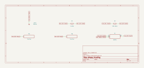

# simple_inverting

SBOA092B page 70, *Simple Inverting sign changing amplifier*: the inverting
amplifier with values. R_I = 1 kΩ in, R_O = 100 kΩ across, the + input on
ground.

```
E_O = -(R_O / R_I) E_I = -100 E_I
resistor = R_O R_I / (R_I + R_O) = 1 kΩ
Z_in = R_I = 1 kΩ
```

## The circuit



The schematic is compiled from the program and drawn by KiCad, and it opens in
KiCad as [`out/simple_inverting.kicad_sch`](out/simple_inverting.kicad_sch). A part with a symbol
of its own is drawn with it; the op amp and the handbook's other parts are
boxes carrying their own pins, and each net is a label rather than a wire.


The interconnect view is fang's own projection. It names the parts as the
program does, so it reads against the code below.

## What the program says

The resistors are the figure's, so the gain and input impedance need no
choice: `a_v = -R_O/R_I = -100` and `z_in = R_I = 1 kΩ`.

The page's third line, "resistor", names a part the figure does not draw. It
is the bias-compensation resistor that normally goes from the + input to
ground, sized to R_O ∥ R_I so both input bias currents drop the same voltage.
The program builds the figure as drawn, with the + input straight to ground,
and keeps the value as a parameter, `r_compensation`, held to R_O ∥ R_I =
990.1 Ω and within 1% of the printed 1 kΩ.

The bench's op amp has no bias current. To show what the undrawn resistor is
for, one run adds 100 nA out of the - input with a card (`bias` records the
value and why it is a card): with nothing on the + input to cancel it, the
whole I_B R_O = 10 mV appears at the output.

## What the simulation found

[`out/simulation.txt`](out/simulation.txt), from the decks under
[`out/spice/`](out/spice/):

| Run | Measured | Claimed |
| --- | ---: | ---: |
| `gain`, E_I = 0.1 V: E_O / E_I | -99.99 | -100 (`a_v`) ± 0.1%, holds |
| `gain`: input impedance | 1 kΩ | 1 kΩ (`z_in`), holds |
| `bias_error`, E_I = 0, 100 nA on the - input | 9.999 mV | 10 mV (`e_bias`), holds |

The gain misses -100 by 1 part in 10^4, the model's 10^6 open-loop gain
against a noise gain of 101.

## Where the handbook is off

Only in drawing: the "resistor" the page sizes is not in the figure, and its
value is 990 Ω, which the page rounds to 1 kΩ.

## Running it

```bash
fang check examples/ti_opamp_handbook/dc_amplifiers/simple_inverting/simple_inverting.py
python examples/regenerate.py ti_opamp_handbook/dc_amplifiers/simple_inverting   # needs ngspice and kicad-cli
```
