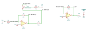

# common_mode_rejection

SBOA092B page 75, *Common Mode Rejection*: "subtraction by inverting and
summing". The bottom op amp inverts E2 (R4 and R5, 10 kΩ each). The top op amp
sums: E1 through R1, and the inverted E2 through R2 (9.1 kΩ) in series with R3
(a 5 kΩ pot wired as a rheostat), both into its inverting input, with R0
(100 kΩ) as feedback.

```
E_O = -(R_O / R1)(E1 - E2) = 10 (E2 - E1)
R2 + R3 = R1
R3: common mode adjustment. Set for zero output when E1 = E2.
```

## The circuit



The schematic is drawn by [copperhead](https://github.com/copperheadhq/copperhead)'s
drafting engine from this circuit's netlist, with KiCad's own library symbols,
and it opens in KiCad as [`figure/common_mode_rejection.kicad_sch`](figure/common_mode_rejection.kicad_sch).
The op amp is KiCad's generic one, since the handbook's are ideal, and each
terminal is a test point named as the program names it. KiCad reads back from
the sheet exactly the connections the circuit has; `draw.py` refuses to write
one that does not.


The interconnect view is fang's own projection. It names the parts as the
program does, so it reads against the code below.

## What the program says

Written out, the top amplifier gives

```
E_O = -(R0/R1) E1 + (R0/(R2 + R3))(R5/R4) E2
```

so the output is zero for E1 = E2 when R2 + R3 = R1 (R5/R4), which is the
page's rule since R5 = R4.

The program records a reading (`reading`) because the drawn values satisfy
neither printed equation (see below). It takes R1 = 10 kΩ, and records the
trim (`trim`): the rheostat's wiper is tied to its summing-point end, and it
is set 0.82 of the way along, leaving 0.9 kΩ in circuit so R2 + R3 = 10 kΩ.
The constraints hold the gains to the parts (`a_e1 = -R0/R1`,
`a_e2 = R0/(R2 + R3) · R5/R4`, `a_inv = -R5/R4`), the trim rule, that the pot
can reach it (`R2 ≤ R1 ≤ R2 + R3`), and that the two paths are equal and
opposite.

## Where the handbook is off

As drawn, R1 is 1 kΩ. That makes the gain R0/R1 = 100, not the printed 10,
and R2 + R3 can only range from 9.1 to 14.1 kΩ, so it can never equal R1.
The E2 path is then worth at most 100/9.1 = 11 at the output against E1's
100, and no setting of R3 nulls the output for E1 = E2. The trim-range
constraint would fail on the drawn value.

One change fixes both printed equations: R1 = 10 kΩ. The gain becomes 10, as
printed, and the trim point falls at 0.9 kΩ of the 5 kΩ pot. The other
candidates each fix only one equation (R0 = 10 kΩ gives the gain but not the
trim) or need two misprints (R2 = 910 Ω and R3 = 500 Ω), and `reading` lists
them.

## What the simulation found

[`out/simulation.txt`](out/simulation.txt), from the decks under
[`out/spice/`](out/spice/):

| Run | Measured | Claimed |
| --- | ---: | ---: |
| `e1_alone`, E1 = 1 V | -10 | -10 (`a_e1`), holds |
| `e2_alone`, E2 = 1 V | 10 | 10 (`a_e2`), holds |
| `e2_alone`: bottom amplifier | -1 | -1 (`a_inv`), holds |
| `difference`, E1 = 0.4 V, E2 = 0.6 V | 2 V | 2 V, holds |
| `common_mode_trimmed`, E1 = E2 = 1 V | -20 µV | 0 V ± 100 µV, holds |
| `common_mode_untrimmed`, R3 at mid-travel | -1.379 V | -10 + 100/11.6, holds |

The 20 µV left at the trim point is the inverter's finite open-loop gain: its
gain is short of -1 by about 2 parts in 10^6, and the top amplifier multiplies
that by 10. The untrimmed run is what the adjustment is for.

## Running it

```bash
fang check examples/ti_opamp_handbook/differential_amplifiers/common_mode_rejection/common_mode_rejection.py
python examples/regenerate.py ti_opamp_handbook/differential_amplifiers/common_mode_rejection   # needs ngspice
```
