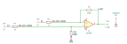

# difference_amplifier

SBOA092B page 74, *Difference Amplifier*: the subtractor with gain. R_I =
1 kΩ and R_O = 100 kΩ in both legs; E1 into the inverting input, E2 divided
by R_I over R_O onto the non-inverting input.

```
E_O = -(R_O / R_I)(E1 - E2) = 100 (E2 - E1)
```

## The circuit



The schematic is drawn by [copperhead](https://github.com/copperheadhq/copperhead)'s
drafting engine from this circuit's netlist, with KiCad's own library symbols,
and it opens in KiCad as [`figure/difference_amplifier.kicad_sch`](figure/difference_amplifier.kicad_sch).
The op amp is KiCad's generic one, since the handbook's are ideal, and each
terminal is a test point named as the program names it. KiCad reads back from
the sheet exactly the connections the circuit has; `draw.py` refuses to write
one that does not.


The interconnect view is fang's own projection. It names the parts as the
program does, so it reads against the code below.

## What the program says

The figure gives every value, so nothing is chosen. The two legs' ratios are
required to match, and the matched ratio is the claim, `a_d = 100`.

## What the simulation found

[`out/simulation.txt`](out/simulation.txt), from the decks under
[`out/spice/`](out/spice/):

| Run | Measured | Claimed |
| --- | ---: | ---: |
| `difference`, E1 = 1.02 V, E2 = 1.05 V: E_O | 3 V | 3 V, holds |
| `difference`: E_O / (E2 - E1) | 99.99 | 100 (`a_d`) ± 0.1%, holds |
| `common_mode`, E1 = E2 = 2 V: E_O | -7.8 fV | 0 V ± 100 µV, holds |

The gain is 99.99 rather than 100 because the model's open-loop gain is 10^6
against a noise gain of 101. The 30 mV difference rides on about 1 V of
common mode, and the output carries only the difference.

## Running it

```bash
fang check examples/ti_opamp_handbook/differential_amplifiers/difference_amplifier/difference_amplifier.py
python examples/regenerate.py ti_opamp_handbook/differential_amplifiers/difference_amplifier   # needs ngspice
```
