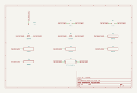

# differential_input_output

SBOA092B page 75, *Differential Input-Output*: the balanced output amplifier
of page 69 with values. R_I = 1 kΩ and R_O = 10 kΩ in both legs; E1 into the
inverting input with R_O to the top output, E2 into the non-inverting input
with R_O to the bottom output. The page says only "for use in driving
floating loads. Input may be floating source." The gain is page 69's:

```
E_O = (R_O / R_I)(E2 - E1) = 10 (E2 - E1)
```

## The circuit



The schematic is compiled from the program and drawn by KiCad, and it opens in
KiCad as [`out/differential_input_output.kicad_sch`](out/differential_input_output.kicad_sch). A part with a symbol
of its own is drawn with it; the op amp and the handbook's other parts are
boxes carrying their own pins, and each net is a label rather than a wire.


The interconnect view is fang's own projection. It names the parts as the
program does, so it reads against the code below.

## What the program says

The resistors are the figure's. The program cites page 69 for the gain
(`gain_rule`) and requires the two legs to match and `a_d = R_O / R_I = 10`.

The page's point is a load across the two outputs with no ground on it. The
figure draws none, so the program records the one the bench adds (`load`):
1 kΩ between the output terminals, in one run. The bench's outputs are ideal,
so the load shows only that nothing needs a ground, not how a real part's
outputs would sag.

Where the two outputs sit together is set inside the op amp (page 69 says so),
and the model holds it at ground; the bottom output is reported, not claimed.

## What the simulation found

[`out/simulation.txt`](out/simulation.txt), from the decks under
[`out/spice/`](out/spice/):

| Run | Measured | Claimed |
| --- | ---: | ---: |
| `difference`, E1 = 0.1 V, E2 = 0.4 V: gain | 10 | 10 (`a_d`), holds |
| `difference`: bottom output | -1.5 V | not a claim |
| `floating_load`, 1 kΩ across the outputs: E_O | 3 V | 3 V, holds |
| `floating_load`: load current | 3 mA | not a claim |
| `common_mode`, E1 = E2 = 1 V: E_O | 2.3 fV | 0 V ± 100 µV, holds |

## Running it

```bash
fang check examples/ti_opamp_handbook/differential_amplifiers/differential_input_output/differential_input_output.py
python examples/regenerate.py ti_opamp_handbook/differential_amplifiers/differential_input_output   # needs ngspice and kicad-cli
```
