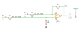

# subtractor

SBOA092B page 74, *Subtractor*: the differential input amplifier of page 67
with every resistor 10 kΩ. E1 goes through R_I into the inverting input with
R_O back from the output; E2 is divided by R_I over R_O onto the
non-inverting input.

```
E_O = E2 - E1
```

## The circuit



The schematic is drawn by [copperhead](https://github.com/copperheadhq/copperhead)'s
drafting engine from this circuit's netlist, with KiCad's own library symbols,
and it opens in KiCad as [`figure/subtractor.kicad_sch`](figure/subtractor.kicad_sch).
The op amp is KiCad's generic one, since the handbook's are ideal, and each
terminal is a test point named as the program names it. KiCad reads back from
the sheet exactly the connections the circuit has; `draw.py` refuses to write
one that does not.


The interconnect view is fang's own projection. It names the parts as the
program does, so it reads against the code below.

## What the program says

The figure gives every value, so nothing is chosen. Two constraints: the two
legs have the same R_O/R_I ratio, which is what makes the circuit subtract,
and that ratio is the gain, `a_d = 1`.

## What the simulation found

[`out/simulation.txt`](out/simulation.txt), from the decks under
[`out/spice/`](out/spice/):

| Run | Measured | Claimed |
| --- | ---: | ---: |
| `difference`, E1 = 1.5 V, E2 = 4 V: E_O | 2.5 V | 2.5 V, holds |
| `difference`: E_O / (E2 - E1) | 1 | 1 (`a_d`), holds |
| `common_mode`, E1 = E2 = 2 V: E_O | 0 V | 0 V ± 100 µV, holds |

## Running it

```bash
fang check examples/ti_opamp_handbook/differential_amplifiers/subtractor/subtractor.py
python examples/regenerate.py ti_opamp_handbook/differential_amplifiers/subtractor   # needs ngspice
```
