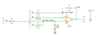
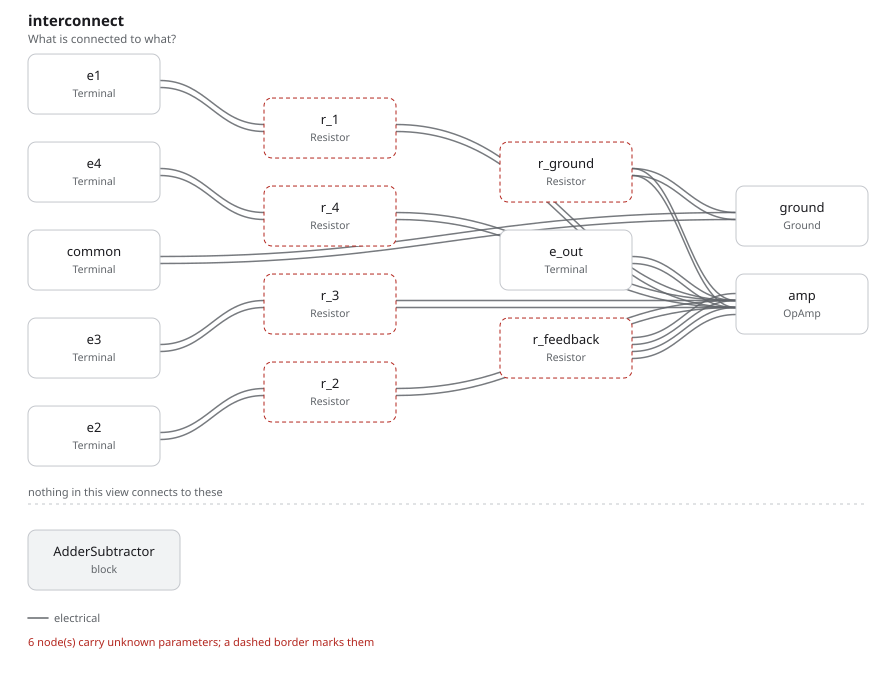

# adder_subtractor

SBOA092B page 68, *Adder-Subtractor or Floating Input Combiner*: E1 and E2
each through a 10 kΩ R into the inverting input with a third R back from the
output, and E3 and E4 each through a 10 kΩ R_I into the non-inverting input
with a third R_I from there to ground.

```
E_O = -E1 - E2 + E3 + E4
```

## The circuit



The schematic is drawn by [copperhead](https://github.com/copperheadhq/copperhead)'s
drafting engine from this circuit's netlist, with KiCad's own library symbols,
and it opens in KiCad as [`figure/adder_subtractor.kicad_sch`](figure/adder_subtractor.kicad_sch).
The op amp is KiCad's generic one, since the handbook's are ideal, and each
terminal is a test point named as the program names it. KiCad reads back from
the sheet exactly the connections the circuit has; `draw_figures.py` refuses to write
one that does not.



The interconnect view is fang's own projection. It names the parts as the
program does, so it reads against the code below.

## What the program says

The figure gives every value, so nothing is chosen. What needed working out is
why the + inputs are worth exactly 1 when the two sides are not built alike.
The + input sits at (E3 + E4)/3, the average of E3, E4 and ground through
three equal R_I. The - side's noise gain is 1 + R/(R ∥ R) = 3. The two meet:
3 × 1/3 = 1. So the printed formula holds, and it holds for any R against R_I
as long as each side is three equal resistors, which is what "R and R_I not
necessarily equal" means.

Each input's weight is a parameter written from the resistors (`a_1` to `a_4`,
and `noise_gain = 3`), for example:

```python
require(
    equals(
        self.a_3,
        over(
            product(parallel(self.r_4.resistance, r_i), self.noise_gain),
            total(self.r_3.resistance, parallel(self.r_4.resistance, r_i)),
        ),
    )
)
```

A fifth input on either side would upset the 3 × 1/3, and the check would say so.

## What the simulation found

[`out/simulation.txt`](out/simulation.txt), from the decks under
[`out/spice/`](out/spice/):

| Run | Measured | Claimed |
| --- | ---: | ---: |
| `e1_alone`, E1 = 1 V | -1 | -1 (`a_1`), holds |
| `e2_alone`, E2 = 1 V | -1 | -1 (`a_2`), holds |
| `e3_alone`, E3 = 1 V | 1 | 1 (`a_3`), holds |
| `e4_alone`, E4 = 1 V | 1 | 1 (`a_4`), holds |
| `all_four`, E1..E4 = 0.1, 0.2, 0.4, 0.8 V: E_O | 0.9 V | 0.9 V, holds |
| `all_four`: the + input | 0.4 V | (E3 + E4)/3, holds |

## Running it

```bash
fang check examples/ti_opamp_handbook/differential_input/adder_subtractor/adder_subtractor.py
python examples/regenerate.py ti_opamp_handbook/differential_input/adder_subtractor   # needs ngspice
```
