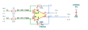
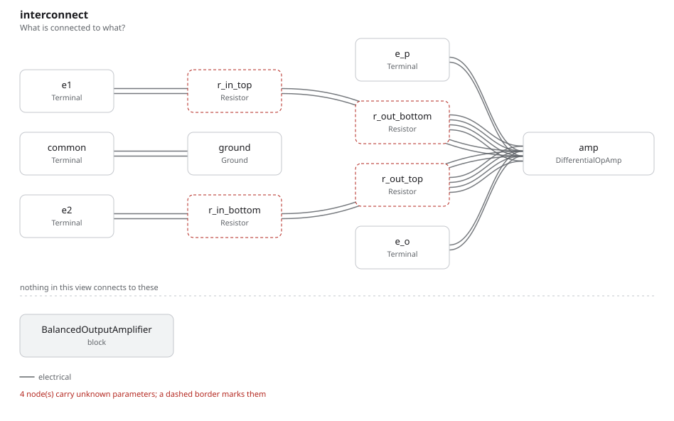

# balanced_output_amplifier

SBOA092B page 69, *The Differential (Balanced) Output Amplifier*: an op amp
with two outputs. E1 goes through R_I into the inverting input with R_O to the
top output; E2 goes through R_I into the non-inverting input with R_O to the
bottom output. The handbook calls the bottom output E_P and the top one
E_O + E_P, so E_O is the difference between the two.

```
E_O = (R_O / R_I)(E2 - E1)
```

## The circuit



The schematic is drawn by [copperhead](https://github.com/copperheadhq/copperhead)'s
drafting engine from this circuit's netlist, with KiCad's own library symbols,
and it opens in KiCad as [`figure/balanced_output_amplifier.kicad_sch`](figure/balanced_output_amplifier.kicad_sch).
The op amp is KiCad's generic one, since the handbook's are ideal, and each
terminal is a test point named as the program names it. KiCad reads back from
the sheet exactly the connections the circuit has; `draw_figures.py` refuses to write
one that does not.



The interconnect view is fang's own projection. It names the parts as the
program does, so it reads against the code below.

## What the program says

The figure gives no values, so the program chooses them (`values`): R_I =
10 kΩ and R_O = 100 kΩ in both legs, a differential gain of 10. Three
constraints: the two R_I are equal, the two R_O are equal (the page's
subtraction of the leg equations needs both), and `a_d = R_O / R_I`.

The page is careful to say that E_f and E_P, where the inputs and outputs sit
together, are not set by the loop. The op amp sets them. The bench's model
(`DifferentialOpAmp`) holds the outputs' common level at ground, so E_P comes
out as -E_O/2. That is the model's choice, not the handbook's, and the program
reports E_P without claiming it.

## What the simulation found

[`out/simulation.txt`](out/simulation.txt), from the decks under
[`out/spice/`](out/spice/):

| Run | Measured | Claimed |
| --- | ---: | ---: |
| `difference`, E1 = 0.2 V, E2 = 0.5 V: gain | 10 | 10 (`a_d`), holds |
| `difference`: E_P | -1.5 V | not a claim |
| `floating`, E1 = 2.2 V, E2 = 2.5 V: E_O | 3 V | 3 V, holds |
| `common_mode`, E1 = E2 = 1 V: E_O | 1.7 fV | 0 V ± 100 µV, holds |

The `floating` run is the page's "ground reference is not critical": the same
0.3 V difference lifted by 2.2 V gives the same E_O.

## Running it

```bash
fang check examples/ti_opamp_handbook/differential_input/balanced_output_amplifier/balanced_output_amplifier.py
python examples/regenerate.py ti_opamp_handbook/differential_input/balanced_output_amplifier   # needs ngspice
```
