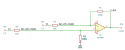
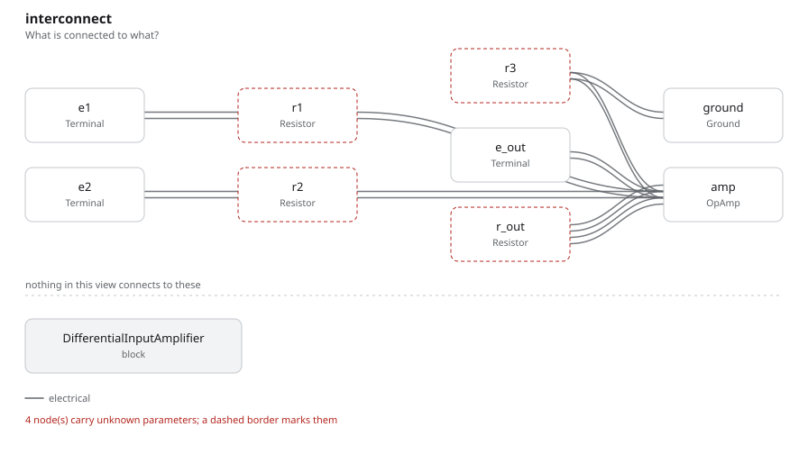

# differential_input_amplifier

SBOA092B page 67, *The Differential Input Amplifier*: E1 through R1 into the
inverting input with R_O back from the output, and E2 through the divider R2
over R3 into the non-inverting input.

```
E_O = (R3/R1)((R1 + R_O)/(R2 + R3)) E2 - (R_O/R1) E1
E_O = (R_O/R1)(E2 - E1)          for R2 = R1, R3 = R_O
```

## The circuit



The schematic is drawn by [copperhead](https://github.com/copperheadhq/copperhead)'s
drafting engine from this circuit's netlist, with KiCad's own library symbols,
and it opens in KiCad as [`figure/differential_input_amplifier.kicad_sch`](figure/differential_input_amplifier.kicad_sch).
The op amp is KiCad's generic one, since the handbook's are ideal, and each
terminal is a test point named as the program names it. KiCad reads back from
the sheet exactly the connections the circuit has; `draw.py` refuses to write
one that does not.



The interconnect view is fang's own projection. It names the parts as the
program does, so it reads against the code below.

## What the program says

The figure gives no values, so the program chooses them (`values`): R1 = R2 =
10 kΩ and R_O = R3 = 100 kΩ, the matched case the page reduces to, for a
differential gain of 10. The program keeps the general formula rather than the
reduced one. `a_e1` is what E1 alone is worth at the output and `a_e2` what E2
alone is worth, each written from the four resistors:

```python
require(equals(self.a_e1, negative(over(self.r_out.resistance, self.r1.resistance))))
require(
    equals(
        self.a_e2,
        product(
            over(self.r3.resistance, self.r1.resistance),
            over(
                total(self.r1.resistance, self.r_out.resistance),
                total(self.r2.resistance, self.r3.resistance),
            ),
        ),
    )
)
require(equals(self.a_e2, negative(self.a_e1)))
```

The third line is the matching condition: change R3 alone and the check fails,
because the common-mode voltage would no longer cancel.

## What the simulation found

[`out/simulation.txt`](out/simulation.txt), from the decks under
[`out/spice/`](out/spice/):

| Run | Measured | Claimed |
| --- | ---: | ---: |
| `e1_alone`, E1 = 1 V, E2 = 0 | -10 | -10 (`a_e1`), holds |
| `e2_alone`, E1 = 0, E2 = 1 V | 10 | 10 (`a_e2`), holds |
| `difference`, E1 = 0.3 V, E2 = 0.5 V | 2 V | 2 V, holds |
| `common_mode`, E1 = E2 = 1 V | -1.7 fV | 0 V ± 100 µV, holds |

With the ratios matched the common-mode voltage cancels whatever the open-loop
gain, so the last run reads ngspice's rounding rather than an op amp error.
The page's note that the ground reference does not matter is the same fact:
only E2 - E1 reaches the output.

## Running it

```bash
fang check examples/ti_opamp_handbook/differential_input/differential_input_amplifier/differential_input_amplifier.py
python examples/regenerate.py ti_opamp_handbook/differential_input/differential_input_amplifier   # needs ngspice
```
