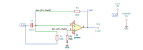

# augmented_differentiator

SBOA092B page 62, *Augmented Differentiator*: 0.1 µF C_I and 100 kΩ R_I side
by side from E_I to the inverting input, 100 kΩ R_O back from the output, and
50 kΩ R2 from the non-inverting input to ground.

```
E_O = -R_O E_I / R_I - R_O C_I dE_I/dt = -E_I - (1/100) dE_I/dt
```

## The circuit



The schematic is drawn by [copperhead](https://github.com/copperheadhq/copperhead)'s
drafting engine from this circuit's netlist, with KiCad's own library symbols,
and it opens in KiCad as [`figure/augmented_differentiator.kicad_sch`](figure/augmented_differentiator.kicad_sch).
The op amp is KiCad's generic one, since the handbook's are ideal, and each
terminal is a test point named as the program names it. KiCad reads back from
the sheet exactly the connections the circuit has; `draw_figures.py` refuses to write
one that does not.


The interconnect view is fang's own projection. It names the parts as the
program does, so it reads against the code below.

## What the program says

R_I makes an inverting amplifier of gain `a_dc = -R_O/R_I = -1`, C_I a
differentiator of `time_constant = R_O C_I = 10 ms`, and the summing point adds
them. In frequency terms E_O/E_I = -(1 + j 2π f × 10 ms): the two terms are
equal at `f_equal = 1/(2π R_I C_I)` = 15.9 Hz.

R2 is bias compensation, the DC resistance the - input sees, and the program
holds it to that:

```python
require(equals(self.r_bias.resistance, parallel(r_i, r_o)))
```

The bench's op amp has no bias current, so the simulation shows only that R2
does no harm. The figure gives every value, so nothing was chosen.

## What the simulation found

[`out/simulation.txt`](out/simulation.txt), from the decks under
[`out/spice/`](out/spice/):

| Run | Measured | Claimed |
| --- | ---: | ---: |
| `input_term`, E_I = 1 V DC | -1 | -1 (`a_dc`), holds |
| `both_terms`, gain at 1 Hz | 1.002 | \|1 + j 0.063\| = 1.002, holds |
| `both_terms`, gain at 15.9 Hz | 1.414 | \|1 + j\| = 1.414, holds |
| `both_terms`, phase at 15.9 Hz | -2.356 rad | -3π/4, holds |
| `both_terms`, gain at 159 Hz | 10.05 | \|1 + j 10\| = 10.05, holds |
| `peak`, where the output turns real | 12.62 kHz | not a claim |
| `peak`, height | 107.6 dB | not a claim |

The page does not mention it, but the derivative term has no stop, so this
circuit shares the plain differentiator's peak where its rising noise gain
meets the op amp's roll-off, near √(10 MHz × 15.9 Hz) = 12.6 kHz. A practical
version would need the same stop as the circuits above it.

## Running it

```bash
fang check examples/ti_opamp_handbook/differentiators/augmented_differentiator/augmented_differentiator.py
python examples/regenerate.py ti_opamp_handbook/differentiators/augmented_differentiator   # needs ngspice
```
