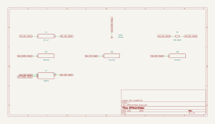

# differentiator

SBOA092B page 61, *Differentiators* (also Figure 43 on page 38): E_I through
C_I into the summing point, R_O from the output back to it, and the
non-inverting input on ground.

```
E_O = -R_O C_I dE_I/dt
```

## The circuit



The schematic is compiled from the program and drawn by KiCad, and it opens in
KiCad as [`out/differentiator.kicad_sch`](out/differentiator.kicad_sch). A part with a symbol
of its own is drawn with it; the op amp and the handbook's other parts are
boxes carrying their own pins, and each net is a label rather than a wire.


The interconnect view is fang's own projection. It names the parts as the
program does, so it reads against the code below.

## What the program says

The figure names C_I and R_O and gives them no values, so the program chooses
them and records the choice as a decision (`values`): 0.1 µF and 100 kΩ, the
same pair as the "with stop" figure below it, for a 10 ms time constant. That
puts the unity-gain point, `f_unity = 1/(2π R_O C_I)`, at 15.9 Hz, where
Figure 43 draws X_C = R_O.

The page warns that the simple circuit is not usable. Figure 43 shows why: the
gain rises at 20 dB per decade and meets the op amp's falling open-loop gain,
and at that crossing the loop has almost no phase margin. The program claims
where that happens, which follows from equating the two lines,
2π f R_O C_I = GBW / f:

```python
require(within(product(self.f_peak, self.f_peak),
               product(self.amp.gain_bandwidth, self.f_unity), 0.0001))
```

so `f_peak` = √(10 MHz × 15.9 Hz) = 12.6 kHz. Change the op amp's
gain-bandwidth and the check fails until `f_peak` moves with it.

## What the simulation found

[`out/simulation.txt`](out/simulation.txt), from the two decks under
[`out/spice/`](out/spice/):

| Run | Measured | Claimed |
| --- | ---: | ---: |
| `derivative`, unity-gain frequency | 15.92 Hz | 15.92 Hz (`f_unity`), holds |
| `derivative`, gain at 100 Hz | 6.284 | 2π × 100 Hz × 10 ms = 6.283, holds |
| `derivative`, phase at 100 Hz | -1.571 rad | -π/2, holds |
| `peak`, where the output turns real | 12.62 kHz | 12.62 kHz (`f_peak`), holds |
| `peak`, height | 3.86 × 10^5 (111.7 dB) | not a claim |

Below the peak the circuit is a derivative, gain and phase both. At 12.6 kHz
the ideal gain would be 793; the circuit gives about 486 times that. The
height is set by how little damping the op amp model's one pole leaves, which
is the model's and not the handbook's, so it is reported, not claimed. The
point stands either way: any noise near 12.6 kHz comes out enormous, which is
what the page means by "susceptible to high frequency noise".

## Running it

```bash
fang check examples/ti_opamp_handbook/differentiators/differentiator/differentiator.py
python examples/regenerate.py ti_opamp_handbook/differentiators/differentiator   # needs ngspice and kicad-cli
```
