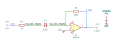

# differentiator_with_stop

SBOA092B page 61, *With "Stop"*: the differentiator with a 1 kΩ R_I in series
with its 0.1 µF C_I, and 100 kΩ R_O from the output back to the summing point.

```
E_O / E_I = -j 2π f R_O C_I / (1 + j 2π f R_I C_I)
```

## The circuit



The schematic is drawn by [copperhead](https://github.com/copperheadhq/copperhead)'s
drafting engine from this circuit's netlist, with KiCad's own library symbols,
and it opens in KiCad as [`figure/differentiator_with_stop.kicad_sch`](figure/differentiator_with_stop.kicad_sch).
The op amp is KiCad's generic one, since the handbook's are ideal, and each
terminal is a test point named as the program names it. KiCad reads back from
the sheet exactly the connections the circuit has; `draw.py` refuses to write
one that does not.


The interconnect view is fang's own projection. It names the parts as the
program does, so it reads against the code below.

## What the program says

Below `f_high = 1/(2π R_I C_I)` the circuit differentiates, its gain passing
unity at `f_low = 1/(2π R_O C_I)`. Above `f_high` R_I outweighs C_I and the
gain stops rising at `a_flat = R_O/R_I = 100`: the "stop". Each is a parameter
held to the parts:

```python
require(within(self.f_high, corner(r_i, c_i), 0.00001))
require(within(self.f_low, corner(r_o, c_i), 0.00001))
require(equals(self.a_flat, over(r_o, r_i)))
```

The figure gives every value, so nothing was chosen.

## Where the handbook is off

The page prints the high frequency cutoff as 0.6 kHz and the low frequency
cutoff as 16 kHz. With its own parts, 1/(2π × 1 kΩ × 0.1 µF) is 1.59 kHz and
1/(2π × 100 kΩ × 0.1 µF) is 15.9 Hz. The program holds the computed values,
`figure` quotes the printed ones, and the simulation agrees with the computed
ones. "Low frequency cutoff" is also a loose name: 15.9 Hz is where the
derivative's gain passes 1, not where anything is cut.

## What the simulation found

[`out/simulation.txt`](out/simulation.txt), from the deck under
[`out/spice/`](out/spice/):

| Measured in `response` | Measured | Claimed |
| --- | ---: | ---: |
| unity-gain frequency | 15.92 Hz | 15.92 Hz (`f_low`), holds; printed 16 kHz |
| gain at 100 Hz | 6.271 | 6.271, holds |
| 3 dB corner | 1.567 kHz | 1.592 kHz (`f_high`) ± 2%, holds; printed 0.6 kHz |
| gain at 1.59 kHz | 71.27 | 70.71 (`a_corner`) ± 1%, holds |
| top of the plateau | 99.97 | 100 (`a_flat`) ± 0.5%, holds |
| where the op amp rolls it off | 100.6 kHz | not a claim |

The corner claims are looser than the rest, and the notes say why. At
1.59 kHz the loop gain is only about 88, and with the op amp's 90° lag the
finite gain lifts the gain 0.8% above the ideal 70.71 instead of lowering it,
which moves the 3 dB crossing 1.6% lower. The op amp, closed for a noise gain
of 101, then rolls the plateau off near 100 kHz. Unlike the plain
differentiator, nothing peaks: the stop keeps the rising gain from reaching
the op amp's roll-off.

## Running it

```bash
fang check examples/ti_opamp_handbook/differentiators/differentiator_with_stop/differentiator_with_stop.py
python examples/regenerate.py ti_opamp_handbook/differentiators/differentiator_with_stop   # needs ngspice
```
