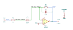
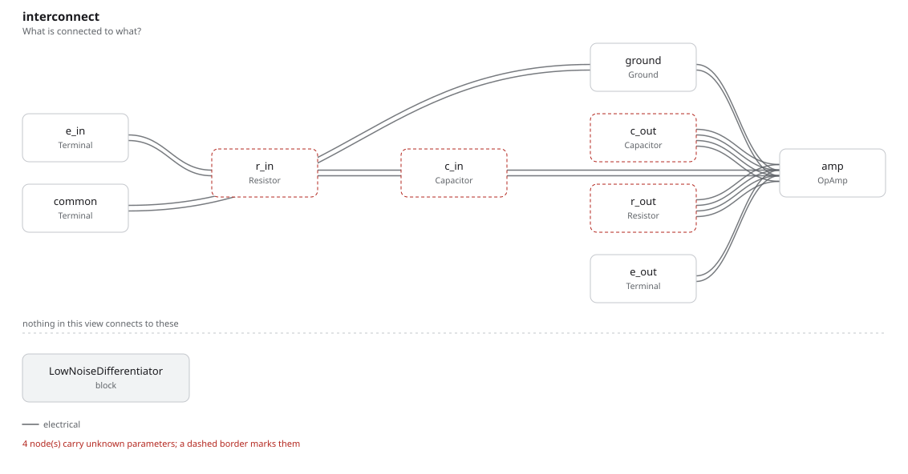

# low_noise_differentiator

SBOA092B page 62, *Low Noise*: the differentiator with stop (1 kΩ R_I and
0.1 µF C_I in series, 100 kΩ R_O) with a 0.001 µF C_O across R_O.

```
E_O / E_I = -j 2π f R_O C_I / ((1 + j 2π f R_I C_I)(1 + j 2π f R_O C_O))
R_I C_I = R_O C_O
```

## The circuit



The schematic is drawn by [copperhead](https://github.com/copperheadhq/copperhead)'s
drafting engine from this circuit's netlist, with KiCad's own library symbols,
and it opens in KiCad as [`figure/low_noise_differentiator.kicad_sch`](figure/low_noise_differentiator.kicad_sch).
The op amp is KiCad's generic one, since the handbook's are ideal, and each
terminal is a test point named as the program names it. KiCad reads back from
the sheet exactly the connections the circuit has; `draw.py` refuses to write
one that does not.



The interconnect view is fang's own projection. It names the parts as the
program does, so it reads against the code below.

## What the program says

The page's rule is a constraint, and the figure's parts meet it exactly, both
products 100 µs:

```python
require(equals(product(r_i, c_i), product(r_o, c_o)))
```

So the two poles sit together at `f_corner` = 1.59 kHz, the "double high
frequency cutoff". Where the circuit with stop flattens at R_O/R_I = 100, this
one peaks at `a_peak = R_O/(2 R_I) = 50` (each pole takes √2) and falls at
20 dB per decade above it: a decade up the gain is `a_decade` = 1000/101 =
9.90. The derivative below is unchanged, passing unity at `f_unity` = 15.9 Hz.

The page's phrase "drift compensating resistor" beside the rule names no part
in the figure, and the program does not invent one. Nothing was chosen.

## What the simulation found

[`out/simulation.txt`](out/simulation.txt), from the deck under
[`out/spice/`](out/spice/):

| Measured in `response` | Measured | Claimed |
| --- | ---: | ---: |
| unity-gain frequency, rising | 15.92 Hz | 15.92 Hz (`f_unity`), holds |
| gain at 1.59 kHz | 50 | 50 (`a_peak`), holds |
| largest gain anywhere | 50 | 50 (`a_peak`), holds |
| gain at 15.9 kHz | 9.751 | 9.901 (`a_decade`) ± 2%, holds |
| unity-gain frequency, falling | 156.6 kHz | not a claim |

The top of the response is a single point at the corner, as the double pole
says. A decade above it the op amp's loop gain is only about 60 and takes
1.5% off, which is why that claim is held to 2%.

## Running it

```bash
fang check examples/ti_opamp_handbook/differentiators/low_noise_differentiator/low_noise_differentiator.py
python examples/regenerate.py ti_opamp_handbook/differentiators/low_noise_differentiator   # needs ngspice
```
