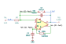

# ac_integrator

SBOA092B page 59, *AC Integrator*: E_I through R_I (100 kΩ) to the - input,
C_O (0.01 µF) and a reset switch to the output. The op amp is drawn with two
outputs. The one at the top is E_O. The bubbled one at the bottom drives R2
(100 kΩ) to the + input, with C_I (100 µF) from there to ground. "Integrates
AC component only." There is no formula.

## The circuit



The schematic is drawn by [copperhead](https://github.com/copperheadhq/copperhead)'s
drafting engine from this circuit's netlist, with KiCad's own library symbols,
and it opens in KiCad as [`figure/ac_integrator.kicad_sch`](figure/ac_integrator.kicad_sch).
The op amp is KiCad's generic one, since the handbook's are ideal, and each
terminal is a test point named as the program names it. KiCad reads back from
the sheet exactly the connections the circuit has; `draw.py` refuses to write
one that does not.


The interconnect view is fang's own projection. It names the parts as the
program does, so it reads against the code below.

## What the program says

The program reads the bubble as an inverted output (`reading`), so the op amp
is a differential-output part (`DifferentialOpAmp`). R2 and C_I then
low-pass -E_O onto the + input, which makes them a DC servo. With
τ1 = R_I C_O = 1 ms and τ2 = R2 C_I = 10 s:

```
E_O/E_I = -(1 + p τ2) / (1 + 2p τ1 + p² τ1 τ2)
```

That is -1 at DC and -1/(p τ1), an integrator, above the corner at
1/(2π √(τ1 τ2)) = 1.59 Hz. The program rejects two other readings. If the
bubble were the same output, the feedback would be positive and would put a
pole in the right half-plane. If R2 and C_I were only a bias return, the
circuit would be a plain integrator that ramps on DC. The parameters are
`f_unity = 159.15 Hz`, `f_corner = 1.5915 Hz` and `q = 50`, all held to the
parts.

## What the simulation found

[`out/simulation.txt`](out/simulation.txt), from the decks under [`out/spice/`](out/spice/):

| Run | Measured | Claimed |
| --- | ---: | ---: |
| `dc`, E_O/E_I for 1 V DC | -1 | -1, holds |
| `sine`, gain at 159 Hz | 1 | 1, holds |
| `sine`, gain at 100 Hz | 1.592 | 1.5915, holds |
| `sine`, phase at 100 Hz | 90.01° | 90°, holds |
| `sine`, gain at 1 mHz | 1.002 | 1.002, holds |
| `sine`, peak | 4573 at 1.585 Hz | not a claim |
| `ac_on_dc`, 0.1 V DC + 0.1 V at 100 Hz, output peak to peak | 318.6 mV | 318.3 mV, holds |
| `ac_on_dc`, output average | -100 mV | -100 mV, holds |
| `dc_step`, 10 mV step, output at 100 s | -10.03 mV | -10 mV, holds |

A DC input comes out inverted and does not ramp. A plain integrator with the
same R_I C_O would be at a rail within a second.

## What the handbook does not say

The drawn values put a resonance at the corner with a Q of 50. A 10 mV DC
step rings at 1.6 Hz up to about ±1 V and takes tens of seconds to settle
(`dc_step`, `e_min` and `e_max`). The `ac_on_dc` run starts its capacitors at
their steady-state values with `.ic` so the resonance is barely excited. That
card names the op amp model's internal node (`xu1.xhalf.n1`), because the
model's outputs are ideal sources that ignore an initial condition.

## Running it

```bash
fang check examples/ti_opamp_handbook/integrators/ac_integrator/ac_integrator.py
python examples/regenerate.py ti_opamp_handbook/integrators/ac_integrator   # needs ngspice
```
